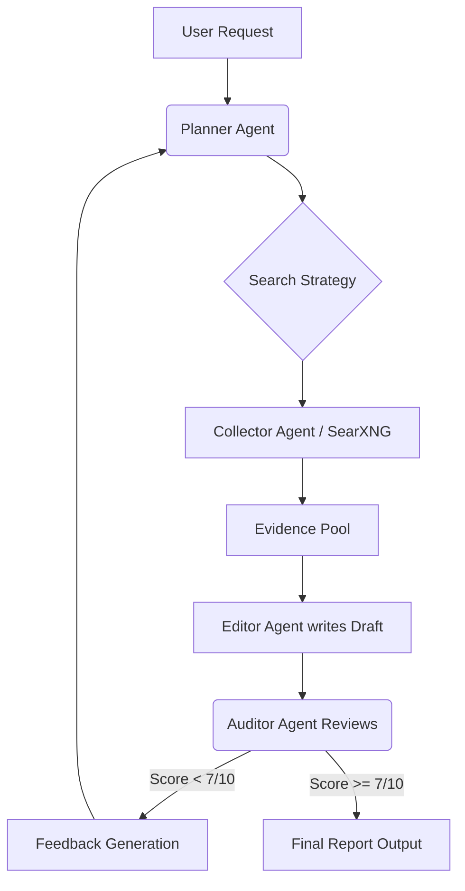

## 1. Executive Summary

This project has evolved from a standard conversational interface into an **Autonomous Recursive Research Engine**. 

While traditional RAG (Retrieval-Augmented Generation) systems perform a linear "Search $\to$ Answer" process, this project implements a **Self-Refining Loop**. It treats the Large Language Model (LLM) not as a chatbot, but as a central processing unit that assumes multiple distinct roles (Planner, Researcher, Auditor, Editor) to iteratively improve the quality of an output before the user ever sees it.

The primary goal is to achieve high-fidelity, hallucination-resistant research reports running entirely on local hardware (LM Studio + SearXNG) without relying on external cloud APIs.

---

## 2. Architectural Achievements

The core innovation of this project is the transition from a linear chain to a state-based loop. The system currently implements the following architecture:

### 2.1 The Multi-Agent Swarm
Instead of a single system prompt, the orchestrator dynamically swaps context to simulate a team of experts:

1.  **The Planner:** Analyzes the user's abstract request and breaks it down into concrete, searchable queries.
2.  **The Collector (Tool User):** Interfaces with a local SearXNG instance to scrape, read, and summarize real-time web data.
3.  **The Editor:** Synthesizes the collected evidence into a coherent draft.
4.  **The Auditor (The Critic):** The most critical component. It reads the draft, compares it against the evidence, and assigns a quality score. **If the score is low, it rejects the draft and triggers a new search loop.**

### 2.2 The Refinement Loop (The "Self-Correction" Mechanism)
I have successfully implemented a feedback loop that mimics human revision:



### 2.3 Evidence Management
*   **Dynamic Context Injection:** The system maintains a growing `evidence_pool.json`.
*   **Source Tracking:** Every claim in the final output is traceable back to a specific URL retrieved during the collection phase.

---

## 3. Current Capabilities (What Works)

As of the current build, the system demonstrates the following capabilities:

*   **Autonomous Error Correction:** If the Collector finds irrelevant data, the Auditor catches it, and the Planner rewrites the search terms automatically.
*   **Privacy-First Architecture:** The entire stack runs offline (air-gapped capable), ensuring no data leaks to OpenAI or Anthropic.
*   **Structured Output:** The system moves beyond chat bubbles, generating comprehensive Markdown files (`final_report.md`) suitable for professional use.
*   **Tool Use:** Successful integration with SearXNG for real-time web access.

---

## 4. Technical Challenges & Solutions

### Challenge 1: The "Yes-Man" Problem
*   **Issue:** Smaller local models (7B/8B parameters) tend to be too agreeable when acting as Auditors, approving bad drafts.
*   **Solution:** I implemented "Chain of Thought" prompting for the Auditor, forcing it to list *negative* aspects before assigning a score. This significantly improved critique quality.

### Challenge 2: Context Window Saturation
*   **Issue:** After 3 loops of research, the accumulated text exceeded the 8k/32k context window of local models.
*   **Solution:** Implemented an intermediate "Summarizer" step. Raw HTML is compressed into semantic bullet points before being added to the Evidence Pool.

---

## 5. Roadmap & Next Steps

This report marks the completion of the core logic. The next phase of development focuses on optimization:

1.  **Memory Persistence:** Allow the agents to read previous reports to answer follow-up questions without re-doing research.
2.  **Parallel Execution:** Currently, searches happen sequentially. I plan to implement `async` processing to allow the Collector to scrape multiple sites simultaneously.
3.  **UI Overhaul:** Transitioning from a chat interface to a "Dashboard" view, where users can see the agents "thinking" and view the progress of the research loop in real-time.

---

## Appendix: Reproduction Steps

To replicate the current research results locally:

**Prerequisites:**
*   [LM Studio](https://lmstudio.ai/) (Running a server on port 1234)
*   [SearXNG](https://github.com/searxng/searxng) (Running locally via Docker)
*   Python 3.10+

**Installation:**
```bash
git clone https://github.com/alexleun/Self-Refining-LLM-Chat.git
cd Self-Refining-LLM-Chat
pip install -r requirements.txt
```

**Configuration:**
Edit `config.yaml` to point to your local model and search instance.

**Execution:**
```bash
python main.py
```
```