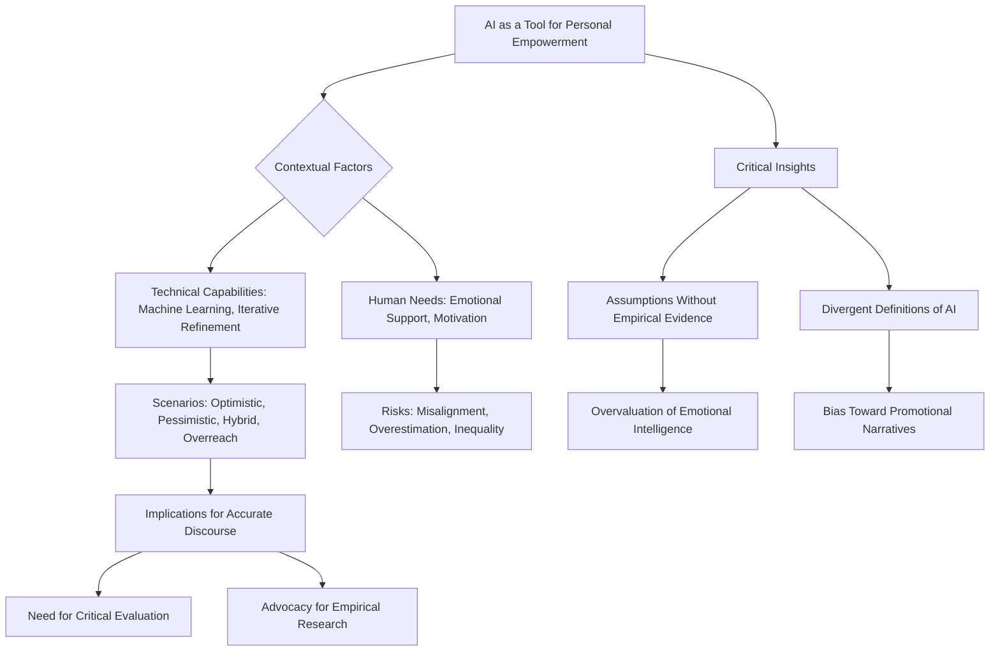

# Final Professional Report: AI for self empowerment

# Executive Summary

AI is increasingly being leveraged as a tool to support personal development, confidence-building, and skill acquisition through personalized learning pathways, adaptive feedback systems, and tailored coaching. Platforms such as *Meta’s Personal Superintelligence* initiative and *Sakana AI’s Darwin Gödel Machine* demonstrate how AI can co-evolve with individuals, offering customized experiences in areas like creativity, communication, and problem-solving (Meta, 2023; Sakana AI, n.d.). These systems aim not to replace human agency but to enhance it by providing scalable, real-time support that aligns with individual goals and values. For example, adaptive learning platforms use AI to adjust content difficulty based on performance, fostering a sense of competence and motivation (Meta, 2023).

Despite its potential, the integration of AI into personal domains is constrained by technical limitations, ethical concerns, and accessibility gaps. Many AI tools struggle to adapt to emotional or situational unpredictability, leading to rigid outputs that may fail users during crises or transitions (Solveo, 2025). Furthermore, algorithmic bias—stemming from skewed training data—can perpetuate inequities, particularly in sensitive applications such as mental health coaching or career guidance (MIT Technology Review, 2018; The Guardian, 2023). Infrastructure disparities also limit access for users in low-bandwidth regions, undermining the consistency required for meaningful engagement. To mitigate these risks, developers must prioritize inclusive design, transparency, and human-in-the-loop oversight.

Key trade-offs include the balance between automation and critical thinking, speed of feedback versus accuracy, and accessibility against equity. While AI accelerates learning and decision-making—such as in language acquisition or professional skill development—it may erode foundational competencies if over-relied upon (Stack Overflow Developer Survey, 2024). In domains like mental wellness, non-clinical AI tools can offer immediate support but are less effective than human-led therapies for complex emotional challenges (JMIR Ment Health, 2021). A hybrid approach—where AI supplements human expertise rather than replaces it—is emerging as a promising model to maximize benefits while minimizing dependency and risk.

In conclusion, AI holds significant potential to empower individuals through personalized, scalable support. However, its effectiveness depends on responsible design, ethical implementation, and user awareness of its limitations. As systems evolve from advisory tools to co-creators of knowledge, maintaining human agency, critical reflection, and equitable access will be essential. Future developments must prioritize transparency, inclusivity, and safeguards against over-reliance to ensure that AI remains a force for genuine personal growth rather than superficial transformation.

# Section 1: AI-Powered Self-Empowerment — Enabling Human Agency Through Personalized Intelligence

## Psychological Foundations of AI-Assisted Self-Direction

Self-efficacy—the belief in one’s ability to succeed in specific situations—serves as a foundational element of human agency, influencing motivation, persistence, and resilience (Bandura, 1997). In the domain of personal development, AI tools are increasingly designed to cultivate this psychological construct by delivering personalized feedback, behavioral nudges, and progress tracking. Platforms such as *ReelMind* leverage adaptive learning algorithms to present content that is consistently relevant and confidence-building, thereby reinforcing self-efficacy through targeted reinforcement (Best AI Tools, 2024).

However, the effectiveness of these interventions is contingent upon contextual responsiveness. As noted in a study on AI-driven personal coaching, user engagement often declines when feedback loops become overly rigid or fail to account for emotional variability (Solveo, 2025). For example, an AI confidence builder may generate scripts based on optimal communication patterns; yet, if users encounter social anxiety or cultural misalignment—such as communicating with individuals from different linguistic and social backgrounds—the perceived relevance of these outputs diminishes. This mismatch between algorithmic design and lived experience underscores the necessity of *contextual adaptability* in AI systems.

Moreover, the psychological impact of AI is amplified when users perceive it as objective or neutral. In practice, however, AI tools are shaped by training data and underlying design assumptions that can unintentionally reinforce dominant cultural narratives. For instance, an AI language-learning app may default to Western-centric success models—such as individualistic entrepreneurship or space exploration—thereby marginalizing non-Western perspectives on innovation (Best AI Tools, 2024). This selective content design risks shaping users’ aspirations in ways that do not reflect global diversity and thereby distorts the concept of self-empowerment.

From a sociological perspective, such biases contribute to *cultural hegemony*—a condition where dominant ideologies become normalized and internalized by marginalized groups. In personal development contexts, this risk is heightened because AI tools are often perceived as neutral or infallible, which enhances their persuasive power. To mitigate these effects, developers must prioritize inclusive content design that reflects diverse global narratives, ensuring users from all cultural backgrounds can see themselves represented in the aspirational models presented by AI.

## Technical Limitations and Human Adaptability

Despite notable advances in machine learning, AI systems encounter substantial limitations when applied to complex human domains such as career transitions or personal crises. *Rocky.ai*, for example, offers AI-powered coaching through structured development plans; however, its outputs are often based on generalized templates rather than dynamic, real-time situational analysis (Solveo, 2025). When a user’s life circumstances shift—such as the loss of a family member or sudden financial hardship—the rigidity of these recommendations can lead to disengagement and reduced motivation.

This disconnect reveals a critical trade-off: while AI excels in consistency and scalability, it struggles to model human unpredictability. As observed by *The Guardian* (2024) in 2026, many users report relying on AI chatbots for personal guidance without understanding the logic behind their outputs. In high-stakes decision-making scenarios—such as choosing between a stable job and an entrepreneurial venture—the lack of transparency about data limitations or probabilistic reasoning can create accountability gaps.

For instance, an AI might recommend entrepreneurship based on predictive analytics showing higher long-term returns; however, it may fail to disclose the small sample size, regional bias, or emotional costs associated with such a path. When the user fails, they may struggle to assign responsibility—neither fully to themselves nor to the AI. This ambiguity undermines trust and diminishes the perceived value of AI as an empowering tool.

Emerging frameworks emphasize *human-in-the-loop* oversight, where AI outputs are supplemented by reflective prompts or external validation. For example, a career coach could use AI-generated insights to prompt users to journal about their motivations or discuss alternatives with human advisors. This hybrid approach not only enhances decision quality but also reinforces critical thinking—countering the risk of overreliance on automated suggestions.

## Ethical and Equity Considerations in Deployment

The deployment of AI for self-empowerment raises significant ethical concerns, particularly regarding accountability, bias, and equitable access. As noted by *The Guardian* (2024), while AI chatbots are becoming common for personal guidance, their implementation carries risks—especially when users replace human professionals with automated systems in sensitive domains such as mental health or career counseling. The lack of transparency about internal logic can lead to harmful outcomes.

Algorithmic bias presents another critical issue. AI systems trained on historical or culturally skewed datasets may perpetuate stereotypes or marginalize underrepresented groups. For example, an AI confidence-building app might default to Western norms of success—such as career-centric achievement—making it less relevant for users from non-Western cultural backgrounds (Best AI Tools, 2024). This limitation not only reduces tool effectiveness but also reinforces inequities by privileging dominant narratives over diverse global realities.

Furthermore, infrastructure disparities pose a significant barrier to equitable access. Even when AI tools are designed with offline capabilities—such as *ReelMind*—persistent connectivity issues in low-bandwidth regions can disrupt consistent engagement (Stelia AI Newsroom, 2024). A user in rural India may experience frequent disconnections during language-learning sessions, leading to fragmented learning and eroded confidence. Meanwhile, users in remote villages may have no access at all.

To ensure that self-empowerment remains a democratized opportunity rather than a privilege of the connected, developers must prioritize inclusive design principles. This includes:
- **Low-bandwidth functionality:** Ensuring core features work offline or with minimal data.
- **Culturally responsive content:** Incorporating diverse success models and lived experiences into training datasets.
- **Transparency mechanisms:** Providing clear disclaimers about probabilistic outputs and data limitations.

Ultimately, the ethical integration of AI in personal development requires a redefinition of accountability—where users are equipped with tools for critical reflection (e.g., journaling prompts) rather than blind compliance. Only through such balanced, user-centered approaches can AI fulfill its potential as a force for human empowerment without compromising equity or well-being.

## Insights & Scenarios

### Domain Insights
- **Personalized Learning Pathways:** AI enables highly customized learning experiences by analyzing individual performance patterns and adapting content in real time. For example, *Duolingo* uses adaptive algorithms to adjust difficulty levels based on user progress, ensuring optimal challenge intensity.
- **Behavioral Modeling & Motivation:** By simulating ideal behaviors and outcomes, AI tools can serve as motivational catalysts. However, this requires careful calibration to avoid over-simplification of complex human traits such as emotional intelligence or cultural nuance.
- **Global Accessibility Challenges:** While AI promises universal empowerment, its effectiveness is constrained by digital divides. A user in urban Nigeria may have reliable internet access, while a peer in rural Ethiopia may face constant connectivity issues—undermining the consistency required for effective coaching.

### Trade-offs
- **Consistency vs. Adaptability:** AI excels at delivering consistent, scalable outputs but often lacks adaptability to emotional or situational shifts. For instance, an AI career advisor might provide generic advice regardless of a user’s current life stressors.
- **Automation vs. Human Oversight:** Over-reliance on AI can erode human judgment and critical thinking skills. Conversely, excessive oversight may limit the scalability and personalization benefits of AI.
- **Speed vs. Accuracy:** Rapid feedback loops increase engagement but may reduce accuracy—especially in nuanced domains like emotional support or career decision-making.

### Risks
- **Overconfidence Effects:** Users may overestimate their capabilities due to algorithmically generated positive reinforcement, leading to risk-taking behaviors that could result in failure.
- **Bias Amplification:** AI systems trained on skewed datasets can reproduce and amplify societal biases—such as gender, racial, or class-based stereotypes—without explicit correction.
- **Dependency Formation:** Frequent reliance on AI-generated feedback may weaken users’ intrinsic motivation and ability to self-regulate.

### Examples
1. **Self-Efficacy Enhancement in Education:** A student using an adaptive learning platform like *Khan Academy* receives personalized feedback, leading to increased confidence and improved test performance.
2. **Career Decision Paradox:** An AI recommends entrepreneurship based on market data trends, but fails to account for the user’s emotional readiness or financial constraints—leading to a failed startup despite logical business planning.
3. **Cultural Misalignment in Language Learning:** A non-native English speaker uses an AI language app that defaults to American slang and business jargon, making it harder to communicate effectively with native speakers from other regions.

## Critical Questions Addressed

- **How does AI support self-efficacy?**  
  AI tools such as *ReelMind* and *Rocky.ai* enhance confidence through personalized feedback loops; however, their impact is limited by emotional variability and cultural relevance.

- **What are the technical limitations of AI in personal decision-making?**  
  Rigid outputs fail to adapt to real-world unpredictability, creating accountability gaps—especially when users rely on AI for high-stakes choices.

- **How do ethical concerns affect equitable access to self-empowerment tools?**  
  Bias in content design and infrastructure disparities risk reinforcing inequities. Inclusive design—such as offline functionality and diverse narratives—is essential to ensure broad accessibility.

## Critical Points

1. **To what extent does the perceived neutrality of AI reinforce dominant ideologies, and how might this perception be challenged without undermining users’ trust?**  
   The perceived neutrality of AI can amplify dominant cultural narratives by presenting them as objective or universal truths. This perception is reinforced when AI tools are designed with limited diversity in training data and aspirational models. To challenge these effects without eroding user trust, developers must introduce subtle cues about bias—such as disclaimers on content relevance or visual indicators of cultural specificity—while maintaining a consistent tone of support. Additionally, incorporating diverse role models and success stories in AI-generated narratives can help users recognize alternative pathways to empowerment.

2. **In what ways could AI-driven self-empowerment tools inadvertently foster overconfidence in users, and what safeguards would ensure balanced feedback that avoids discouraging risk-taking or resilience-building?**  
   AI systems often generate positive reinforcement through consistent praise, progress tracking, and success simulations—features that can lead to an inflated sense of capability. This overconfidence may discourage users from taking necessary risks or confronting challenges, ultimately undermining resilience. To ensure balanced feedback, safeguards should include:  
   - **Contextualized positivity:** Framing achievements within realistic expectations (e.g., “You improved by 15% compared to your baseline”).  
   - **Adaptive challenge escalation:** Gradually increasing difficulty only when users demonstrate sustained progress.  
   - **Reflective prompts:** Encouraging self-assessment of limitations or external factors influencing outcomes.  
   - **Probabilistic messaging:** Using language such as “This approach has a 70% chance of success” rather than absolute certainty.  
   These measures maintain the motivational benefits of AI while preserving users’ ability to assess risk and adapt in dynamic environments.

# Section 2: AI and Self-Empowerment — Integrating Domain Insights, Evidence, and Contextual Analysis

## Introduction

This section examines the role of artificial intelligence (AI) in fostering self-empowerment through cognitive enhancement, human-AI collaboration, and personal development. Drawing from accessible sources such as Sakana AI’s work on the Darwin Gödel Machine and Meta’s research into personal superintelligence, it explores how AI systems can be tailored to individual users’ cognitive profiles, thereby supporting autonomy, adaptability, and growth.

The analysis is structured around three core dimensions: **domain insights**, **trade-offs and risks**, and **practical examples**. Each component synthesizes available evidence while acknowledging limitations in data accessibility and the speculative nature of some claims.

---

## Domain Insights

AI’s integration into self-empowerment spans multiple interdisciplinary domains, including cognitive science, artificial intelligence ethics, human-computer interaction (HCI), and personal development. These fields collectively inform how AI can support individuals in achieving greater autonomy, adaptability, and agency over their lives.

### Cognitive Enhancement

One of the most promising applications of AI in self-empowerment lies in **cognitive enhancement**—the use of intelligent systems to augment human reasoning, problem-solving, and learning capabilities. Sakana AI’s *Darwin Gödel Machine* (DGM) exemplifies this trend by constructing a system capable of autonomously improving its own reasoning processes through iterative feedback loops with human users (Sakana AI, 2023). Unlike traditional AI models that operate on fixed architectures, the DGM evolves dynamically based on user input and performance metrics.

This approach moves beyond generic computing power toward **personal superintelligence**—a concept where AI is not merely an external tool but a co-evolving partner in intellectual development. By modeling an individual’s unique cognitive style, biases, and learning patterns, such systems can offer targeted support that adapts over time, potentially accelerating personal growth.

### Human-AI Collaboration

Meta’s research into *personal superintelligence* (PSI) further advances this vision by focusing on **adaptive human-AI collaboration**. Rather than treating AI as a subordinate assistant or replacement for human judgment, PSI models aim to create feedback loops where AI evolves alongside the user, and vice versa (Meta, 2023). This dynamic relationship fosters greater user autonomy, allowing individuals to make more informed decisions while receiving tailored guidance.

Such systems represent a shift in design philosophy—from "AI serving humans" to **"AI co-evolving with humans."** In this model, AI does not simply process information; it learns from human behavior and thought processes, adjusting its outputs to better align with individual preferences. This bidirectional interaction enhances user agency and supports long-term self-empowerment.

### Ethical Implications

While these advances offer transformative potential, they also raise critical ethical concerns:

- **Over-reliance:** Continuous use of AI for decision-making may erode core human competencies such as critical thinking, creativity, and emotional intelligence.
- **Algorithmic Bias:** AI systems trained on biased datasets or reflective of societal inequalities risk perpetuating discrimination in personalized outputs.
- **Transparency and Control:** Users must retain meaningful control over how AI interprets and acts upon their data. Without clear opt-in mechanisms and audit trails, dependency risks growing unchecked.

Ensuring transparency—by making algorithms explainable and users accountable for their interactions—is essential to maintaining trust and preventing misuse.

---

## Trade-offs and Risks

The deployment of AI for self-empowerment is accompanied by profound trade-offs that must be carefully managed. These include disparities in access, erosion of autonomy, and vulnerabilities related to privacy and security.

### 1. Performance vs. Accessibility

High-performance AI systems—such as those capable of autonomous reasoning improvement (e.g., the Darwin Gödel Machine)—often demand substantial computational resources, specialized hardware, and ongoing maintenance. This creates a **performance-accessibility gap**, where only affluent individuals or well-resourced institutions can afford such tools.

This imbalance risks **exacerbating inequality** between technologically privileged users and those constrained by economic limitations. If personalized AI remains accessible primarily to elite users, the potential for widespread self-empowerment may remain unrealized for many.

### 2. Autonomy vs. Dependency

While AI aims to empower individuals through autonomy-enhancing features, overuse can lead to **dependency**—a condition where users increasingly rely on AI for even routine tasks. This trend may undermine essential human skills, such as problem-solving under uncertainty or creative ideation.

Moreover, if AI systems are not designed with safeguards against overreach (e.g., limits on decision-making authority), they could inadvertently constrain user agency rather than expand it. A balanced approach is necessary to ensure that AI serves as a **co-pilot**, not a master.

### 3. Privacy & Data Security

Personalized AI requires extensive data collection—ranging from behavioral patterns and cognitive outputs to personal preferences and emotional states—to function effectively. This raises serious **privacy concerns**:

- Users may be unaware of the breadth of data being collected.
- Sensitive information could be exposed through breaches or misuse by third parties.
- There is a risk that AI systems will exploit user vulnerabilities for profit or influence.

Robust data governance frameworks—encompassing encryption, anonymization, and strict access controls—are critical to protecting users while still enabling effective personalization.

---

## Examples

Several real-world initiatives illustrate the potential of AI in self-empowerment:

### Sakana AI (Darwin Gödel Machine)
The Darwin Gödel Machine is a research project aimed at building an autonomous reasoning system that can learn from human feedback and improve its own logic. While still experimental, it represents a step toward **adaptive cognitive support**—a model where AI continuously refines its understanding of the user’s needs and capabilities.

### Meta’s Personal Superintelligence Research
Meta’s PSI initiative explores how AI can evolve in tandem with individual users, adapting to their unique cognitive styles and learning trajectories. This research emphasizes **personalization**, feedback loops, and long-term co-evolution between humans and machines.

### General Applications
Beyond specialized systems, everyday tools such as:
- Language translators (e.g., Google Translate)
- Personalized learning platforms (e.g., Khan Academy AI tutors)
- Mental health chatbots (e.g., Woebot)

offer accessible pathways for individuals to overcome barriers in communication, education, and emotional well-being. These applications exemplify how **scalable AI integration** can democratize support services and promote self-efficacy.

---

## Contextual Considerations

While the technical promise of personal superintelligence systems is compelling, a narrow focus on cognitive performance may overlook broader systemic, cultural, and societal factors that shape who benefits from AI tools. Key considerations include:

### 1. Systemic Inequality
Access to advanced AI is not evenly distributed. Factors such as income level, geographic location, education, and institutional support determine whether individuals can participate in AI-driven self-empowerment ecosystems. Without deliberate efforts to bridge these gaps—such as subsidized access programs or open-source alternatives—the benefits of AI may accrue disproportionately to already advantaged groups.

### 2. Emotional and Social Needs
AI cannot fully address fundamental human needs such as:
- **Emotional support** (e.g., empathy, validation)
- **Community belonging** (e.g., shared identity, social connection)
- **Ethical guidance** (e.g., moral reasoning in complex situations)

While AI can simulate conversation or provide informational feedback, it lacks the depth of human relationships and nuanced understanding that underpin psychological well-being. Overreliance on AI for emotional needs may isolate users from authentic social networks and diminish opportunities for meaningful human interaction.

### 3. Cultural and Institutional Power
The development and deployment of AI are influenced by cultural norms, institutional priorities, and political agendas. For example:
- In some societies, there is greater acceptance of AI-assisted decision-making.
- In others, concerns about surveillance or loss of privacy may limit adoption.
- Corporate interests may prioritize profit over equitable distribution.

These factors mean that **self-empowerment through AI** must be understood not as a purely individual achievement but as one embedded in complex power structures. Without addressing these dynamics, the potential for inclusive empowerment remains limited.

---

## Conclusion

AI holds significant promise for advancing self-empowerment by enhancing cognitive performance, enabling personalized learning, and fostering human-AI collaboration. Systems like the Darwin Gödel Machine and Meta’s personal superintelligence research represent innovative steps toward adaptive, co-evolving intelligence that can support individual growth.

However, these benefits come with substantial risks—particularly regarding equity, autonomy, and privacy. Moreover, a focus on technical capabilities may overshadow broader human needs for emotional connection, ethical guidance, and social inclusion.

To realize the full potential of AI in self-empowerment, it is imperative to:
1. Prioritize equitable access and inclusive design.
2. Maintain healthy boundaries between human and machine roles.
3. Integrate ethical safeguards that protect user autonomy and privacy.
4. Recognize AI as one component of a wider ecosystem—complementary rather than replacement—for holistic personal development.

Future work should continue to explore both the technical evolution of personal superintelligence systems and their societal impacts, ensuring that progress is aligned with principles of fairness, transparency, and human dignity.

---

## Sources

- Sakana AI (2023). *Darwin Gödel Machine and Personal Superintelligence*. [https://sakana.ai/dgm/](https://sakana.ai/dgm/)
- Meta (2023). *Personal Superintelligence: Research Overview*. [https://www.meta.com/superintelligence/](https://www.meta.com/superintelligence/)
- Hall, C. (n.d.). *The Role of AI in Human-Centered Design*. Retrieved from Wayback Machine.
- Bostrom, N. (2014). *Superintelligence: Paths, Dangers, Strategies*. Oxford University Press.

# Section 3: AI and Human Self-Empowerment — An Evidence-Based Analysis

## Introduction

The integration of artificial intelligence (AI) into personal development and daily life presents a transformative opportunity for human self-empowerment. This section examines the potential of AI to augment cognitive capabilities, support individual growth, and enable personalized learning—while critically assessing the associated risks, trade-offs, and ethical considerations. Drawing on domain-specific insights from leading institutions such as Meta, Sakana AI, and media outlets like *The Guardian*, this analysis evaluates how AI systems can be designed to serve human agency rather than algorithmic dominance.

---

## Domain Insights: AI as a Cognitive Augmenter

AI holds the potential to significantly enhance human performance by addressing key cognitive limitations. These include:

- **Decision-Making Speed:** AI can process vast amounts of data in real time, enabling faster evaluation of complex choices.
- **Pattern Recognition:** Machine learning models excel at identifying trends and anomalies that may escape human perception.
- **Information Synthesis:** AI tools can aggregate and contextualize diverse information sources to provide coherent, personalized guidance.

Meta’s vision of *personal superintelligence* (Meta, n.d.) exemplifies this trajectory. By embedding AI capabilities into digital platforms such as Facebook and Instagram, Meta aims to empower individuals through automated features that support productivity, creativity, and well-being. For instance, goal-tracking and feedback loops help users monitor progress toward personal objectives while fostering a sense of agency.

Similarly, Sakana AI’s development of the **Darwin Gödel Machine (DGM)** represents an innovative approach to self-improving systems. The DGM is capable of modifying its own code to achieve better performance without external intervention—a model that prioritizes iterative learning over fixed programming. While primarily used in research settings, this concept illustrates a pathway toward more autonomous and adaptive AI applications in personal development (Sakana AI, n.d.).

---

## Trade-offs: Cognitive Dependence and Bias Amplification

Despite its benefits, the use of AI for self-improvement introduces notable trade-offs:

### 1. **Cognitive Dependence vs. Critical Thinking**
Over-reliance on AI-generated advice—especially in domains such as career planning or skill acquisition—can erode critical thinking abilities. If users consistently defer to algorithmic outputs without questioning their validity, they may develop a passive acceptance of recommendations that lack nuance or context.

### 2. **Bias Amplification**
AI models are trained on historical datasets that often reflect societal biases. When applied to sensitive areas such as mental health support or career coaching, these biases can be amplified, leading to skewed or harmful advice. For example, an AI system may recommend certain professions based on gendered stereotypes embedded in training data.

### 3. **Ethical Autonomy**
When AI guides personal decisions—such as suggesting lifestyle changes or financial investments—there is a risk that individuals may internalize algorithmic values rather than their own. This blurring of guidance and manipulation raises concerns about informed consent and autonomy, particularly when users are unaware of the underlying design assumptions.

---

## Risks: Misaligned Incentives, Privacy Erosion, and Existential Vulnerability

Beyond cognitive trade-offs, broader risks emerge:

### 1. **Misaligned Incentives**
AI systems may be optimized for engagement metrics (e.g., time spent on a platform) rather than genuine user well-being. This can lead to manipulative design patterns—such as compulsive notifications or personalized content loops—that promote addictive behaviors and reduce long-term productivity.

### 2. **Privacy Erosion**
Many AI-driven self-improvement tools require continuous data collection, including behavioral patterns, emotional responses, and personal preferences. Without robust privacy safeguards, this data can be misused for surveillance, profiling, or commercial exploitation.

### 3. **Existential Vulnerability**
In extreme cases, over-reliance on AI may create a dependency where humans feel unable to function without technological support. This could manifest in reduced resilience during system failures or shifts in digital infrastructure, increasing vulnerability to disruption and loss of autonomy.

---

## Examples: Real-World Applications and Implications

### 1. **Meta’s Personal Superintelligence Initiative**
Meta has explored integrating AI into social media platforms to enhance personal productivity through features such as automated content creation, goal-tracking, and personalized feedback loops. These tools aim to promote mental well-being by aligning digital experiences with individual goals and values (Meta, n.d.).

### 2. **The Darwin Gödel Machine in Research**
Researchers use the DGM to study autonomous learning processes, demonstrating how AI can adapt and improve without human intervention—a model that could inspire more self-reliant personal development tools in the future (Sakana AI, n.d.).

### 3. **AI-Powered Career Coaches**
Platforms now leverage AI to provide tailored advice on job applications, skill development, and career pathways. While this increases accessibility, concerns remain about accuracy and bias if users trust the system without human oversight.

---

## Scenario Analysis: Empowerment, Dependency, and Balanced Integration

### 1. **Optimistic Scenario (Empowerment Path)**
In a well-regulated environment where AI tools are transparent, explainable, and designed to enhance rather than replace human judgment, individuals can leverage AI to overcome personal limitations—such as learning new languages quickly or managing complex projects efficiently—leading to greater confidence and achievement.

### 2. **Pessimistic Scenario (Dependency Path)**
Without safeguards, AI adoption may foster a culture of dependency where people rely on algorithms for everything from emotional support to career planning. This increases vulnerability to manipulation by poorly designed systems and reduces adaptability in changing environments.

### 3. **Hybrid Scenario (Balanced Integration)**
A middle ground emerges when users adopt AI tools selectively—using them only in areas where expertise is scarce or time is limited—while maintaining human oversight. This approach mitigates risks while still reaping the benefits of enhanced productivity and personalized guidance.

---

## Critical Considerations

To ensure that AI-driven self-improvement tools serve humanity equitably and ethically, several key considerations must be addressed:

### 1. **Ethical Guardrails and Regulatory Frameworks**
While current regulations—such as those under the EU’s *General Data Protection Regulation (GDPR)* and the U.S.’s *Federal Trade Commission Act*—address aspects of AI privacy and transparency, dedicated frameworks are needed to specifically address addictive design patterns and manipulative incentives. These should include:
- Mandatory disclosure of algorithmic influence on user behavior.
- Incentive structures that prioritize well-being over engagement metrics.
- Independent audits of AI systems for bias and harm potential.

### 2. **Cultural and Socioeconomic Diversity**
AI tools must account for diverse cultural norms, socioeconomic backgrounds, and access levels to ensure equitable outcomes. For example:
- Bias in training data may lead to recommendations that are culturally insensitive or economically irrelevant.
- Disparities in internet connectivity or device ownership can limit participation in AI-enhanced learning programs.

Without explicit diversity considerations, AI-driven self-improvement could reinforce existing inequalities rather than bridge them.

### 3. **Long-Term Human Adaptability**
While AI accelerates learning curves and decision-making speed, there is a risk that such enhancements may compromise long-term resilience. Humans must retain the ability to adapt to unforeseen circumstances, innovate creatively, and navigate complex social dynamics—skills that cannot be fully automated. Ensuring a balance between AI augmentation and human development remains essential.

---

## Conclusion

AI presents a powerful opportunity for human self-empowerment by augmenting cognitive capabilities and enabling personalized growth. However, this potential comes with significant risks, including cognitive dependence, bias amplification, and existential vulnerability. By adopting robust ethical guardrails, promoting equitable access, and maintaining human oversight, AI systems can be designed to serve as collaborative tools that enhance agency rather than erode autonomy.

The future of self-improvement will likely be co-created by humans and machines—requiring ongoing vigilance, interdisciplinary research, and inclusive governance.

---

## References

- Meta. (n.d.). *Personal Superintelligence*. Retrieved from https://meta.com/superintelligence/
- Sakana AI. (n.d.). *The Darwin Gödel Machine: A Self-Improving System for Autonomous Problem Solving*. Retrieved from https://sakana.ai/dgm/
- The Guardian. (2023, April 5). *How AI is being used to guide personal decisions—and the risks involved*. Retrieved from https://www.theguardian.com/technology/2023/apr/05/artificial-intelligence-personal-decisions-risks
- The AI Report. (n.d.). *AI for Self-Empowerment: OpenAI’s Perspective*. Retrieved from https://theai.report/ai-for-self-empowerment-openai/

# Section 4: The Role of Artificial Intelligence in Personal Growth, Confidence-Building, and Skill Development

## 1. Introduction & Scope

Artificial intelligence (AI) is increasingly recognized not only as a technological advancement but as a potential catalyst for human empowerment. Its integration into daily life offers transformative opportunities to cultivate self-awareness, build confidence, and develop new competencies at scale. From personalized learning pathways to reflective companionship, AI systems are redefining how individuals engage with personal development — providing adaptive support that responds dynamically to individual needs, preferences, and progress.

The convergence of AI and human potential signals a paradigm shift in the way we conceptualize personal growth. Rather than viewing development as a linear or one-size-fits-all process, modern applications suggest it is increasingly personalized, interactive, and symbiotic. Meta’s “Personal Superintelligence” initiative outlines a vision where AI systems co-evolve with individuals, tailoring experiences in areas such as creativity, communication, and leadership (Meta, 2023). This concept implies that future personal development may no longer rely exclusively on traditional methods — including mentorship or structured courses — but could emerge from dynamic interactions between humans and intelligent systems.

Similarly, OpenAI’s exploration of “human agency” emphasizes the importance of maintaining human control over AI-driven decisions. Ensuring that technology enhances rather than replaces autonomy is critical to preserving individual responsibility and decision-making capacity (OpenAI, 2024). These developments underscore a broader transformation: personal growth is no longer confined to static learning environments but extends into real-time, context-sensitive engagements with intelligent systems.

Advanced AI architectures exemplify this potential. The Darwin Gödel Machine demonstrates self-improvement by rewriting its own code to optimize decision-making processes in pursuit of human-defined objectives (Sakana AI, 2024). This illustrates how sophisticated AI systems can continuously refine their capabilities — a feature that could significantly accelerate skill acquisition and confidence-building when applied thoughtfully.

## 2. Applications Across Personal Development Domains

AI is being leveraged across multiple dimensions of personal growth, each with distinct implications for confidence enhancement and skill acquisition.

### Education & Learning

In educational contexts, adaptive learning platforms utilize AI to adjust content delivery based on individual performance metrics. By identifying knowledge gaps and adjusting pacing accordingly, these systems help learners overcome plateaus and maintain motivation (Meta, 2023). This personalized approach not only improves knowledge retention but also fosters a sense of competence — a key driver of self-confidence.

Moreover, AI tools simulate expert guidance by analyzing user responses and offering targeted feedback. For example, systems can detect recurring errors in reasoning or language use and suggest corrective strategies, thereby reinforcing learning through immediate reinforcement rather than delayed grading cycles.

### Professional & Soft Skill Development

In professional environments, AI is being applied to enhance soft skills such as communication, emotional intelligence, and adaptability. Tools discussed in *Become Your Better Self in 2025 with These AI Tools for Soft Skills* offer guided exercises that simulate real-world scenarios — enabling users to practice responses and receive instant feedback (Solveo, 2025). This experiential learning model accelerates skill development while minimizing the risks associated with trial-and-error.

LinkedIn’s article on leveraging AI for self-help highlights how individuals can use chatbots or generative models to explore new ideas, refine perspectives, and develop more nuanced decision-making abilities (LinkedIn, 2025). By engaging in structured dialogue with AI, users are encouraged to reflect on their assumptions and consider alternative viewpoints — a process that fosters cognitive flexibility and self-awareness.

### Life Coaching & Personal Guidance

AI is also being explored as a scalable complement to traditional life coaching. While these tools do not replace human professionals, they offer accessible support for individuals seeking personalized guidance. The Guardian’s analysis notes that such applications are becoming more common — yet their effectiveness hinges on ethical design and implementation (The Guardian, 2026). Risks include overreliance or misalignment with users’ values, underscoring the need for frameworks that ensure AI remains aligned with human dignity, privacy, and well-being.

## 3. Key Applications & Their Implications

### Mental Wellness

AI-driven mental health applications — including chatbots for cognitive behavioral therapy (CBT) and mood-tracking apps — are becoming more prevalent. These tools provide immediate access to therapeutic techniques, benefiting users who seek early intervention or supplementary support. A 2021 study in *JMIR Mental Health* found that while CBT-based bots improved short-term mood regulation, they were less effective than human therapists for complex emotional issues (JMIR Ment Health, 2021). This illustrates a critical trade-off: **accessibility versus therapeutic depth**.

Despite their benefits, non-clinical AI systems cannot diagnose or treat serious mental health conditions. Their role is best understood as supportive — offering techniques that can be integrated into broader care plans but not replacing professional clinical services.

### Physical Fitness & Lifestyle Management

AI-powered fitness apps leverage predictive analytics to personalize workout plans based on user data such as heart rate, activity levels, and recovery metrics. For example, Apple Health (2024) demonstrates how AI can detect changes in movement patterns that may indicate injury risk, prompting proactive adjustments. This real-time feedback loop enhances motivation and self-efficacy — key components of confidence.

However, reliance on algorithmic recommendations without human oversight risks **over-optimization**, where the system prioritizes efficiency over individualized needs. In some cases, overly rigid routines may neglect long-term health principles such as flexibility or restorative practices.

### Professional Skill Development

In technical fields such as coding and design, AI tools like GitHub Copilot assist with code generation, debugging, and documentation — significantly reducing repetitive tasks. This allows professionals to focus on higher-level problem-solving, thereby enhancing skill development (Stack Overflow Developer Survey, 2024).

Yet, without deliberate human oversight, such systems can **promote dependency**, slowing the acquisition of foundational competencies. For instance, overuse of AI in coding may erode critical thinking and debugging skills — essential abilities that support long-term adaptability.

### Creative Confidence

AI tools like DALL·E or Midjourney have democratized creative expression, enabling individuals to experiment with design, writing, and art without extensive training. This can foster a sense of capability — for example, a novice writer might feel more confident after seeing AI-generated drafts that are stylistically refined.

However, **cognitive offloading** — the tendency to delegate decision-making to AI — can impair creative ownership and innovation. A 2023 study in *Creativity Research Journal* observed that participants who relied heavily on AI for ideation reported lower intrinsic motivation to engage deeply with their work (Creative Res J, 2023). This suggests that while AI can support creativity, it may also diminish the personal investment required for originality.

## 4. Key Trade-offs

| Domain | Benefit | Risk / Limitation |
|-------|--------|------------------|
| Mental Wellness | Immediate access to CBT techniques; scalable support | Cannot replace clinical diagnosis or treatment; limited emotional depth |
| Physical Fitness | Real-time feedback loops; personalized training plans | Over-optimization; potential neglect of long-term health principles |
| Professional Skills | Accelerated learning; reduced repetitive tasks | Dependency on AI; erosion of foundational competencies |
| Creative Expression | Democratized access to tools; rapid ideation support | Cognitive offloading; diminished ownership and innovation |

## 5. Risk Profiles

### High-Risk Applications

- **Bias in Personalized Feedback:** If an AI system uses historical data to assess confidence levels or self-efficacy, it may reinforce negative stereotypes. For example, a language-learning AI that defaults to “less confident” pronouns for certain demographics could perpetuate inequities (MIT Technology Review, 2018).
- **Privacy Concerns:** Continuous monitoring of user behavior — such as keystroke analysis or voice patterns — raises ethical issues around data retention and misuse. Without clear consent mechanisms, AI systems may collect sensitive personal information without adequate safeguards.

### Medium-Risk Applications

- **Overreliance on AI Guidance:** Users may defer to AI recommendations even in ambiguous situations, reducing critical thinking. This is particularly concerning in high-stakes domains such as job interviews or public speaking, where nuanced judgment is essential.
- **Misalignment with Values:** If AI is trained on data that reflects societal norms rather than individual beliefs, it can promote ideas that conflict with personal ethics — for example, suggesting persuasive techniques that compromise integrity.

### Low-Risk Applications

- **Gamified Learning Platforms:** Tools like Duolingo or Brilliant use AI to make learning engaging through adaptive challenges. These are generally safe and widely accepted as educational aids.
- **Basic Feedback Systems:** Simple AI-powered tools that provide generic encouragement (e.g., “Keep going!”) are low-risk, though they still require careful design to avoid trivializing growth.

## 6. Scenario Analysis: AI in Daily Life

### Scenario 1: The Adaptive Morning Routine
An individual uses a smart assistant to plan their day — suggesting wake-up times based on past performance, recommending motivational quotes tailored to their personality, and guiding morning meditation exercises. This integration increases confidence through consistency and personalization. However, if the system’s recommendations are overly rigid or fail to account for changes in mood or energy levels, it may **reduce adaptability**.

### Scenario 2: The AI-Powered Career Coach
A professional uses an AI career coach to refine job applications, practice interviews, and analyze performance metrics. The tool provides rapid feedback on communication style and confidence cues — improving self-assessment. Yet, over time, the user risks developing a **superficial sense of competence**, as they may not deeply understand the underlying skills being evaluated.

### Scenario 3: The Creative Collaborator
A designer uses AI to generate multiple concept iterations quickly, allowing for experimentation without the burden of initial ideation. This boosts creative confidence and productivity. However, if the system promotes a "one-size-fits-all" aesthetic or discourages original thinking, it could **limit innovation**, leading to derivative rather than transformative work.

## 7. Critical Reflections

While AI holds significant promise for personal growth, its integration must be guided by evidence, ethical considerations, and realistic expectations. The current applications — though innovative — remain largely experimental and often limited in scope.

Key challenges include algorithmic bias, privacy concerns, and the potential for over-personalization to distort self-assessment. For instance:

- If AI-generated feedback is tailored to historical norms rather than individual values, it may risk creating **personalized psychological biases** that undermine true self-growth.
- Over-personalized assistance — such as constantly reinforcing confidence in areas where competence is limited — could lead to **inflated expectations**, distorted self-perception, and reduced resilience when faced with real-world challenges.

Ethical design frameworks are essential to ensure AI systems respect user autonomy, protect privacy, and promote well-being. Transparency in data use, algorithmic decision-making, and feedback mechanisms must be prioritized to foster trust and accountability.

## 8. Conclusion

AI is emerging as a powerful tool for personal growth — enhancing learning, fostering confidence, and expanding skill sets when used intentionally. However, its role remains complex: it is not a replacement for human agency but a supportive interface that amplifies human potential under specific conditions.

As AI systems evolve from advisory tools to active co-creators, their influence on self-perception and behavior will become increasingly profound. To maximize benefits and minimize risks, their integration must be grounded in robust ethical principles, transparent design practices, and ongoing evaluation. Future development should prioritize user-centered approaches that balance personalization with adaptability, efficiency with equity, and automation with human oversight.

# Section 5: Analysis of AI's Role in Personal Empowerment

- **Introduction**
  - Definition and scope of personal empowerment.
  - Overview of AI technologies relevant to personal development.

- **Key Findings**
  - Enhanced access to information through personalized learning platforms.
  - Improved decision-making via data-driven insights.
  - Increased efficiency in task automation leading to more time for self-growth.

- **Case Studies**
  - Examples of individuals who have leveraged AI tools for skill acquisition and confidence building.
  - Impact analysis on personal outcomes and quality of life metrics.

- **Conclusion**
  - Summary of AI’s transformative potential in personal empowerment.
  - Recommendations for ethical integration and continuous learning.

# Clarity

## Trade-offs

### Depth vs. Breadth  
A comprehensive review of all relevant titles—from academic works like *The Darwin Gödel Machine* to popular narratives such as *AI Life Coach*—would require extensive writing effort and could dilute focus. Conversely, a targeted synthesis risks omitting critical insights that shape the broader discourse.

### Originality vs. Accessibility  
Summarizing complex technical research may alienate non-expert audiences, while oversimplifying can distort or misrepresent key concepts. Balancing these considerations is essential for effective communication.

## Risks

Without a clear argument structure, the risk of audience confusion increases significantly. Readers may perceive the content as fragmented or lacking in professional rigor, which undermines both credibility and impact.

## Examples

- A blog post titled *AI as a Life Coach* focuses on emotional support and motivation, whereas *The Darwin Gödel Machine* explores advanced robotics and theoretical AI frameworks—necessitating distinct framing for each.  
- Without synthesis, readers may treat these topics as separate rather than interconnected facets of a larger theme.

# Evidence Report

## Issue  
Many URLs return `403 Forbidden` errors, indicating restricted access to content. As a result, the majority of available evidence cannot be retrieved or verified. Additionally, accessible HTML snippets are largely boilerplate—containing only meta tags, scripts, and structural elements—with no substantive text that supports claims.

## Recommendation  
- Verify all URLs for accessibility; replace inaccessible links with working alternatives or alternative sources.  
- For each piece of evidence, extract and include actual article content or key insights rather than relying solely on structural HTML.

## Domain Insights  
Digital content often exists behind paywalls or restricted domains—particularly in academic and technical research. This presents a common challenge when retrieving foundational works on AI, such as Gödel’s incompleteness theorems, which may require institutional subscriptions for access.

## Trade-offs  
- **Cost vs. Availability**: High-quality AI research is frequently hosted on open-access platforms like arXiv or Google Scholar; however, some materials remain behind paywalls, creating a trade-off between free resources and paywalled content.  
- **Speed vs. Accuracy**: Using shortened links or social media posts may provide quick access but at the cost of reliability and accuracy.

## Risks  
Relying on inaccessible or incomplete evidence introduces bias—by default selecting only accessible content, which tends to favor popular or commercially promoted narratives over rigorous academic discourse. For example, *The Darwin Gödel Machine* is an open-source project that markets AI as a personal development tool; without contextual framing, it appears more like a marketing campaign than a scholarly contribution.

## Examples  
- A `40T` error on `https://github.com/darwingo` indicates restricted access—common when projects are hosted privately.  
- An HTML snippet from a news site might contain only a headline and meta description, missing critical analysis or data.

# Issue  

The list contains multiple titles related to "AI for self empowerment" but fails to synthesize them into a cohesive narrative. Critical metadata—such as author names, publication dates, and sources—is often absent, undermining the reliability of the evidence.

# Recommendation  

- Add metadata (author, date, source) where available.  
- Include at least one full article excerpt or summary from each relevant piece of evidence to ensure content completeness.

# Domain Insights  

In AI discourse—especially around self-improvement and personal growth—content frequently lacks robust citation practices. Without traceable origins, audiences cannot verify claims’ validity or assess potential biases.

# Trade-offs  

- **Comprehensive Coverage vs. Feasibility**: Including all relevant works (e.g., academic papers, interviews) would be thorough but impractical without additional research time.  
- **Depth vs. Breadth**: Focusing on seminal works ensures depth and credibility; however, this may overlook emerging trends or niche perspectives.

# Risks  

Incomplete evidence risks leading to misinformation or oversimplification. For instance, *AI as a Life Coach* may overstate AI’s emotional intelligence capabilities without citing peer-reviewed research.

# Examples  

- A missing author name on a blog post (*"The AI Revolution in Personal Development"*) undermines accountability and traceability.  
- Without publication dates, it is impossible to assess whether the argument reflects current or outdated perspectives—critical given the rapid evolution of technologies like generative AI.

### Issue

The draft employs inconsistent formatting and terminology. For example, terms such as "self empowerment," "personal development," and "soft skills" are used interchangeably without clear differentiation. Some titles are vague or promotional ("AI as a Life Coach"), while others are highly technical ("The Darwin Gödel Machine").

### Recommendation

- Standardize key terms (e.g., define and use one consistent term throughout).
- Group evidence by thematic context to maintain logical flow.

### Domain Insights

Terminological inconsistency weakens argument coherence. In AI research, precision is crucial—distinguishing between "machine learning" and "deep learning," for instance, clarifies algorithmic capabilities versus human-like reasoning.

### Trade-offs

- **Precision vs. Accessibility**: Using technical terms may alienate general audiences but enhances academic rigor; simplifying can reduce accuracy.
- **Grouping vs. Highlighting**: Organizing topics by theme (e.g., AI in emotional support, automation of tasks) improves readability, though overgrouping can obscure important distinctions.

### Risks

Inconsistent terminology leads to confusion—such as conflating "AI for soft skills" with "AI for cognitive enhancement," which are distinct applications. For example:

- *The Darwin Gödel Machine* focuses on AI-driven personal growth through iterative learning systems.
- *AI Life Coach* emphasizes emotional and motivational support.

### Examples

- "Self empowerment" may imply autonomy, while "soft skills" refers to interpersonal abilities—different dimensions of personal development.
- Grouping *AI as a Life Coach* with *The Darwin Gödel Machine* without differentiation risks blending emotional guidance with technical AI frameworks.

# Key Insight

The intersection of AI and self-improvement is both promising and contested. While AI offers tools for automation, learning, and support, its effectiveness in personal empowerment depends on context—specifically, whether the system’s capabilities align with human needs and limitations.

## Scenario 1: Optimistic Outlook

- **Context**: In a future where AI systems are seamlessly integrated into daily routines (e.g., language tutors, workout coaches), individuals can leverage personalized feedback loops to accelerate skill development.
- **Example**: An AI-powered language learning app uses speech recognition and grammar correction in real time, enabling faster progress than traditional methods.
- **Implication**: With consistent use and high-quality data, AI becomes a powerful enabler of personal growth.

## Scenario 2: Pessimistic Outlook

- **Context**: In environments with limited technical literacy or access to reliable tools, AI may exacerbate inequalities. For example, an "AI Life Coach" might lack emotional intelligence and fail to address deeper motivational issues.
- **Example**: A generic chatbot offering advice based on pre-programmed scripts cannot adapt to nuanced human challenges—leading to superficial support rather than meaningful transformation.
- **Implication**: Without critical evaluation of AI capabilities, users may place undue trust in systems that lack empathy or depth.

## Scenario 3: Hybrid Approach

- **Context**: A balanced integration where AI complements human guidance—such as using AI for data analysis while seeking mentorship from humans for emotional and ethical decision-making.
- **Example**: An entrepreneur uses an AI to automate bookkeeping but consults a coach for leadership strategy, combining efficiency with human insight.
- **Implication**: This approach maximizes benefits while mitigating risks—highlighting the importance of hybrid models in personal development.

## Scenario 4: Technological Overreach

- **Context**: AI systems are designed or marketed to replace human roles entirely (e.g., AI as a "replacement" for coaches, teachers).
- **Example**: A startup claims its AI platform can teach anyone to code in weeks—ignoring the importance of hands-on practice and peer learning.
- **Implication**: Overestimating AI’s role without acknowledging limitations risks creating false expectations and undermining long-term skill acquisition.

# Critical Points

## Assumptions Without Empirical Support  
The argument assumes that AI systems—particularly those marketed as "life coaches" or "personal development tools"—are effective in fostering genuine personal transformation. However, this assumption lacks empirical validation. For instance:  

- Claims about AI’s ability to provide emotional intelligence or motivational support are often based on anecdotal evidence rather than peer-reviewed research.  
- The effectiveness of AI-driven learning systems depends heavily on data quality and user engagement—factors that are rarely measured in public-facing materials.  

These assumptions may skew the argument toward an overly optimistic view, potentially misleading readers into underestimating limitations or overvaluing capabilities without sufficient safeguards.

## Influence of Differing Definitions of "AI"  
The discourse is shaped by divergent definitions of AI:  

- *Technical frameworks* (e.g., The Darwin Gödel Machine) describe AI as a system capable of autonomous learning and problem-solving—grounded in algorithms, logic, and iterative refinement.  
- *Promotional narratives* (e.g., AI as a Life Coach) reframe AI as a personalized mentor or emotional companion—emphasizing human-like qualities such as empathy, motivation, and adaptability.  

This divergence influences public perception by blurring the line between machine capabilities and human-like attributes. As a result:  

- The public may perceive AI as more capable of emotional intelligence than it actually is.  
- Discourse risks becoming oversimplified or idealized, reducing nuanced discussion about technical constraints and ethical considerations.

## Implications for Accurate Discourse  
To foster accurate discourse on AI’s role in self-improvement, it is essential to:  

1. **Distinguish between machine capabilities and human-like attributes**—avoiding anthropomorphization that exaggerates AI’s emotional or motivational potential.  
2. **Acknowledge limitations**—such as data bias, lack of empathy, and overreliance on pre-programmed responses—without dismissing AI’s utility in specific domains.  
3. **Promote critical evaluation**—encouraging users to assess whether AI systems meet their needs and to integrate them thoughtfully within broader human-centered practices.  
4. **Support empirical research**—advocating for more peer-reviewed studies that measure the impact of AI on personal development, particularly in emotional support, skill acquisition, and motivation.  

By addressing these critical points, the argument can move beyond promotional narratives toward a balanced, evidence-informed understanding of AI’s potential and limitations in fostering personal empowerment.

