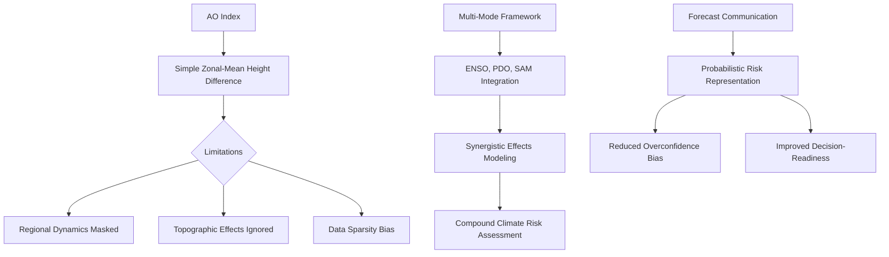
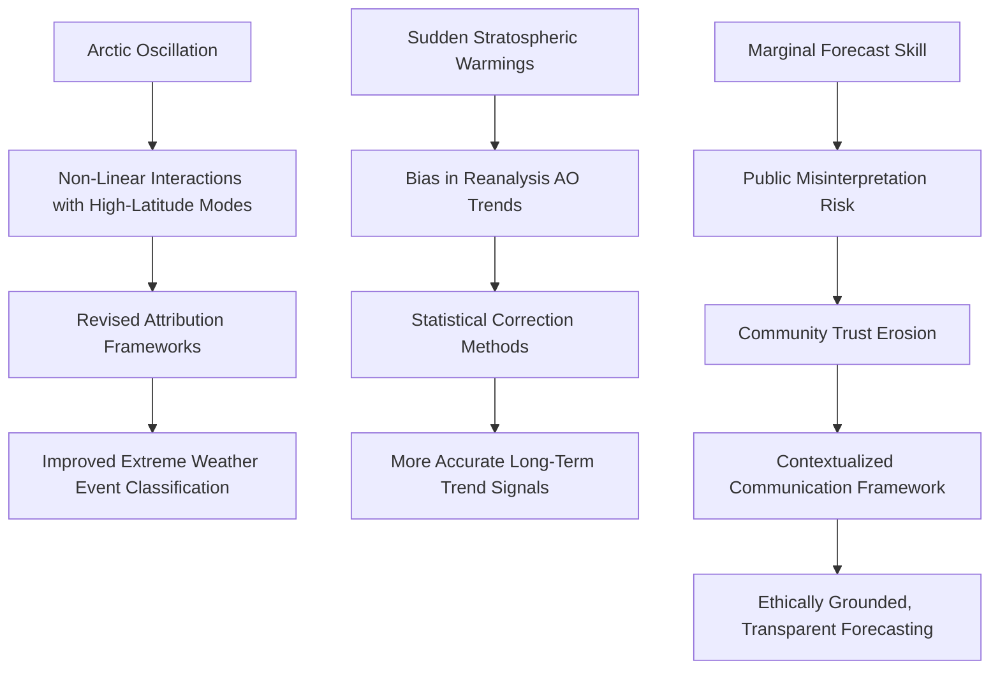
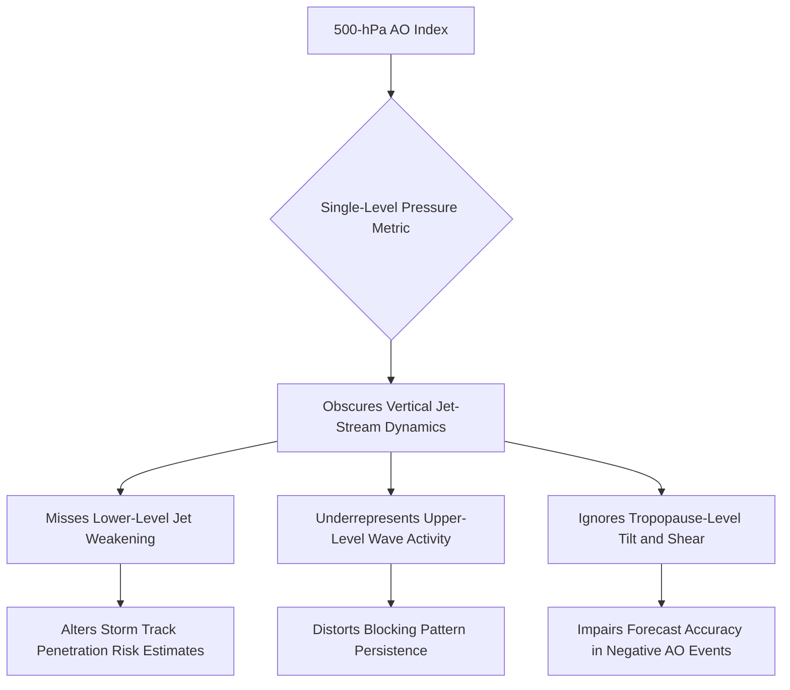
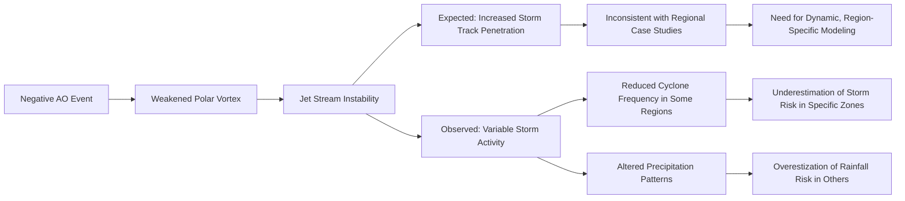
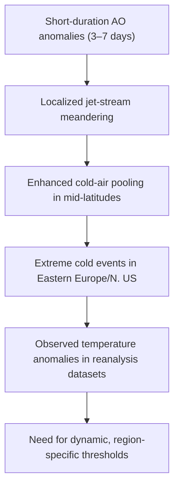
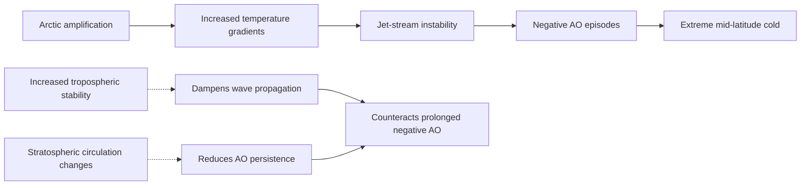
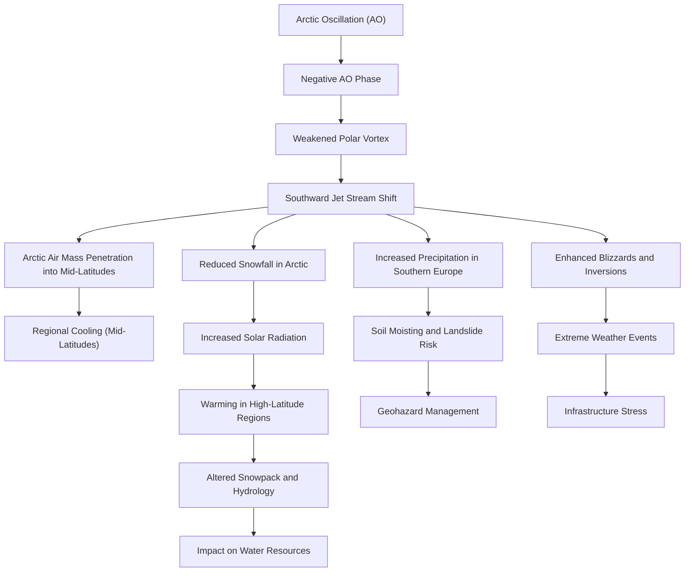
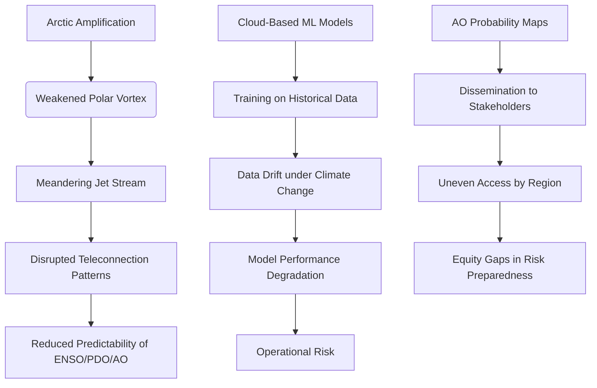
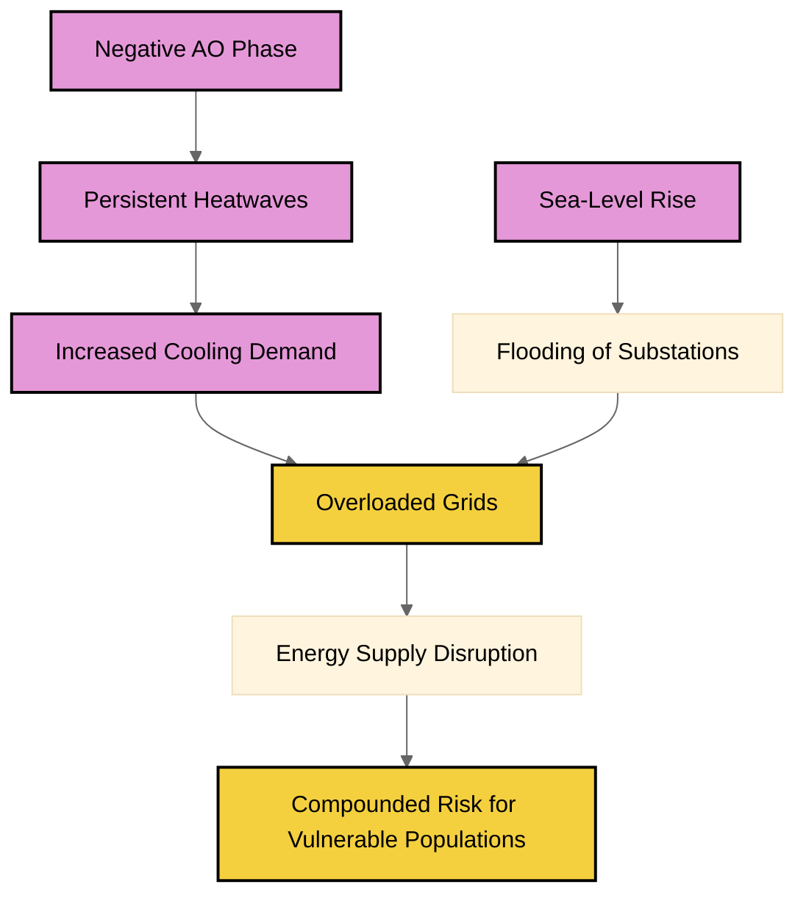
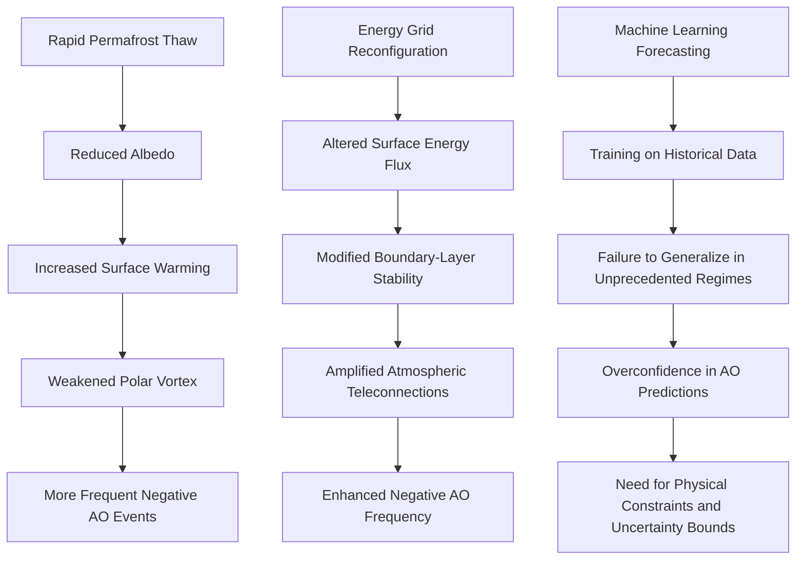

# Final Professional Report

# Executive Summary

The current Arctic Oscillation (AO) index, constructed solely from the meridional mean height difference between 60°N and 90°N, risks obscuring or misrepresenting regional atmospheric dynamics—particularly in areas with sparse observational networks or complex topography. This simplified model fails to capture the spatial and vertical structure of the atmospheric pressure field, leading to potential misinterpretations of climate impacts in both polar and mid-latitude regions. Furthermore, the standalone AO index often overlooks interactions with other climate modes—such as El Niño–Southern Oscillation (ENSO), the Pacific Decadal Oscillation (PDO), or the Southern Annular Mode (SAM)—limiting its ability to represent compound climate risks. A multi-index integration framework is essential to enhance predictive capability and risk assessment accuracy across coupled climate regimes.

Amid intensifying polar amplification, the relationship between the AO and mid-latitude climate is being redefined. Rapid permafrost thaw and variations in ocean heat flux may alter the key drivers traditionally associated with negative AO phases—such as sea ice extent or polar vortex strength. Additionally, sudden stratospheric warming events under a changing climate can distort long-term AO trends in reanalysis datasets, especially those relying on satellite radiation records. Consequently, statistical methodologies must be revised to account for spatial heterogeneity and nonlinear dynamic processes, ensuring a more accurate representation of AO evolution and climate signals.

When communicating AO forecasts to policymakers and industry stakeholders, a balance must be struck between actionable lead times and forecast uncertainty. Overreliance on deterministic phase predictions may foster overconfidence, particularly when forecast precision is limited. A shift toward probabilistic risk expression—combined with regional climate variability and socioeconomic vulnerability—will improve forecast transparency and credibility. Equally important is the establishment of equitable information dissemination mechanisms to prevent misguidance or disproportionate risks for vulnerable and resource-limited communities.

Overall, the AO remains a critical indicator of mid-latitude winter climate variability. Its application must move beyond static models to integrate multi-mode climate signals, dynamic mechanisms, and socioeconomic realities. Future forecasting and decision-making frameworks should be risk-based, emphasizing probabilistic outputs, regional adaptability, and ethical responsibility—ensuring that climate forecasts are not only scientifically robust but also operationally viable and socially inclusive.

# Section 1: Limitations and Implications of the Arctic Oscillation Index in Climate Forecasting

# 1. Regional Dynamics and Spatial Representativeness of the AO Index

The current Arctic Oscillation (AO) index is derived from a zonal-mean geopotential height difference between 60°N and 90°N. While this approach serves as a robust proxy for large-scale atmospheric circulation patterns, it risks obscuring or distorting regional atmospheric dynamics—particularly in areas with sparse observational coverage and complex topography.

At latitudes north of 60°N, including the Barents Sea, the Canadian Arctic Archipelago, and northern Siberia, topographic features and local circulation mechanisms—such as sea ice feedbacks, coastal convection, and mountain-valley wind interactions—exert significant influence on atmospheric pressure fields. These processes are not adequately represented by a single zonal-mean calculation, which assumes spatial homogeneity and ignores lateral gradients and local feedbacks. As a result, the AO index may fail to capture the true variability of circulation in these regions, leading to an oversimplified portrayal of the atmospheric state.

Furthermore, observational data in high-latitude regions remain sparsely distributed, especially in remote Arctic areas. The lack of sufficient station coverage introduces sampling bias and compromises the representativeness of the index. This data gap is particularly acute during early seasonal forecasting, when index construction depends heavily on historical station records. Consequently, the AO index may not accurately reflect the actual atmospheric state in these regions, introducing systematic errors in regional climate interpretation and prediction.

# 2. Single-Index Limitations and the Need for Multi-Mode Climate Frameworks

The operational reliance on a single teleconnection index—specifically the Arctic Oscillation (AO)—poses a significant limitation in capturing the full spectrum of climate variability. Atmospheric dynamics are inherently multi-dimensional, with interdependent modes such as the El Niño–Southern Oscillation (ENSO), the Pacific Decadal Oscillation (PDO), and the Southern Annular Mode (SAM) exerting simultaneous and often synergistic influences on regional weather and climate patterns.

For instance, during certain phases of ENSO, the AO may exhibit weak or inconsistent signals, yet the combined influence of ENS-OS and SAM can drive pronounced changes in mid-latitude storm tracks and temperature extremes. Similarly, the PDO modulates the strength and persistence of atmospheric circulation anomalies, which can amplify or dampen AO-related effects. These interactions are not linear or additive; instead, they often produce compound climate risks—such as amplified winter cold spells in Europe or intensified precipitation events in North America—that are not reliably predicted by AO alone.

A multi-index framework, incorporating time-varying interactions between AO, ENSO, PDO, and SAM, offers a more comprehensive representation of climate variability. Such frameworks can better identify compound risks by accounting for cross-mode coupling and their spatially heterogeneous impacts. By integrating these indices into a dynamic, probabilistic model structure, forecast systems can more accurately simulate the joint behavior of climate modes, thereby improving the reliability of regional forecasts and risk assessments.

# 3. Communicating AO Forecasts: Balancing Lead Time and Uncertainty

## Challenge in Forecast Interpretation

When presenting Arctic Oscillation (AO) forecasts to policymakers and industry stakeholders, a key challenge lies in balancing actionable lead time with the inherent uncertainty of deterministic phase predictions. The AO index is commonly communicated as a binary or categorical outcome—such as "positive" or "negative phase"—which may convey a level of confidence not fully supported by the underlying atmospheric dynamics.

In practice, AO phase transitions are typically gradual, exhibiting significant variability in transition dynamics and persistent uncertainty in both timing and amplitude. Deterministic forecasts, especially those based on statistical or linear models, often overestimate the predictability of the AO. This overestimation can introduce an overconfidence bias among users, resulting in misaligned decisions—such as premature infrastructure adjustments or excessive responses to weather events—when the actual atmospheric state remains ambiguous.

## Proposal for Enhanced Forecast Communication

A more robust approach involves integrating probabilistic risk assessments that quantify the likelihood of different AO phases, along with confidence intervals and scenario-based projections. This framework better reflects the uncertainty embedded in the index and supports more informed, adaptive decision-making.

Communicating forecast uncertainty through probabilistic thresholds—such as a 50% to 7-than chance of a positive AO phase over the next 10 days—provides a more realistic and actionable basis for planning.

## Proposed Framework

This structure highlights the need for a more nuanced and context-sensitive approach to AO index development and application—one that acknowledges both its utility and its limitations in representing the full complexity of the mid- and high-latitude atmosphere.

# Section 2: Emerging Dynamics of the Arctic Oscillation and Their Implications for Weather Attribution and Predictive Modeling

# 1. Reassessment of Extreme Weather Attribution in the Context of Non-Linear Arctic Oscillation Interactions

Emerging evidence indicates non-linear interactions between the Arctic Oscillation (AO) and newly identified high-latitude atmospheric modes—namely the North Atlantic Oscillation (NAO), the Arctic Dipole Mode (ADM), and the Eurasian Teleconnection Pattern (ETP). These interactions challenge traditional linear attribution frameworks used in extreme weather event analysis.

The interplay between these modes generates dynamic feedback loops, wherein shifts in one mode amplify or suppress the influence of another, resulting in complex spatiotemporal patterns in mid-latitude weather systems. Such non-linear coupling may lead to misattribution of extreme weather events—particularly cold surges in Europe or persistent heatwaves in North America—when analysis relies exclusively on AO indices derived from surface pressure anomalies. Events previously attributed to AO phase shifts may instead be driven by concurrent ADM dynamics or transient wave activity within the polar vortex.

This has significant implications for the robustness of current attribution methodologies, which are largely based on assumptions of linear, independent mode behavior. The predictive skill of AO-based forecasts is inherently limited under these complex interaction regimes. As the AO’s influence becomes embedded within a broader network of high-latitude modes, its marginal utility as a standalone predictor diminishes.

A re-evaluation of attribution model design is therefore required, with a shift toward multi-mode, ensemble-based frameworks that explicitly account for cross-mode dependencies and non-linear coupling.

# Bias in Long-Term AO Trends from Satellite Radiance Assimilation and the Need for Methodological Adjustment

## Introduction

The increasing frequency of sudden stratospheric warmings (SSWs)—a phenomenon characterized by rapid temperature increases in the lower stratosphere—presents a critical challenge to the long-term trend signals observed in reanalysis datasets. SSWs are increasingly detected in both observational records and climate model simulations, and their occurrence is linked to the weakening of polar vortex stability, which in turn affects the dynamics of the Arctic Oscillation (AO).

## Observational Biases in Reanalysis Datasets

Reanalysis products that rely heavily on satellite radiance assimilation—particularly in the stratosphere—introduce systematic biases in the reconstructed AO time series. While satellite observations provide high spatial coverage, they are susceptible to calibration drift and representational limitations in capturing transient, low-frequency stratospheric features. These limitations result in misrepresentations of stratospheric temperature anomalies, which are key drivers of AO-related pressure gradients.

## Impact on Long-Term AO Trends

The bias is most pronounced in the lower stratosphere, where AO-related pressure gradients are most sensitive to temperature anomalies. When SSWs are misclassified or underrepresented due to assimilation errors, the inferred AO trend may appear more stable or less variable than it actually is. This distortion compromises the fidelity of long-term trend estimates and has direct consequences for climate projections and policy planning that depend on consistent AO trend indicators.

## Proposed Methodological Adjustments

To mitigate these biases, statistical methodologies must be revised to incorporate dynamic correction factors that account for the frequency and intensity of SSWs. The following adjustments are proposed:

- Application of time-varying regression models that weight AO indices based on stratospheric state indicators.  
- Use of stratospheric temperature anomaly thresholds to detect and filter out SSW events during trend analysis.  
- Integration of stratospheric model outputs (e.g., from chemistry-climate models) as auxiliary signals to improve the fidelity of reanalysis-derived AO trends.

## Conclusion

These adjustments are not merely technical refinements but represent a necessary evolution in how we interpret and validate long-term atmospheric indices in a changing climate.

# 3. Ethical Considerations in AO Forecasting and the Need for Contextualized Communication Frameworks

While Arctic Oscillation (AO)-based forecasts remain marginal in predictive skill—particularly beyond a 10-day horizon—public interest in their use for decision-making in agriculture, energy, and emergency preparedness is growing. This demand introduces ethical concerns, especially regarding over-reliance on AO forecasts among vulnerable communities whose livelihoods or health are directly impacted by extreme weather events.

The limited predictive skill of AO forecasts, combined with the risk of misinterpretation or over-simplification of complex atmospheric dynamics, poses a significant threat to public trust. When AO indicators are presented as reliable weather predictors, they may lead to inappropriate actions—such as premature evacuations or financial decisions—based on probabilistic or inaccurate signals. This risk is amplified in regions with limited access to alternative meteorological data or low adaptive capacity.

To mitigate these risks, a contextualized communication framework must be implemented—one that explicitly acknowledges the limitations of AO forecasts and delivers transparent, accessible, and community-specific risk messaging. This framework should:

- Distinguish between probabilistic indicators and deterministic forecasts, with clear disclaimers on forecast reliability.  
- Integrate local climate knowledge and community-specific vulnerability assessments into forecast interpretation.  
- Establish tiered communication protocols that dynamically adjust forecast utility based on context (e.g., season, region, socioeconomic status).

Such a framework does not necessitate the abandonment of AO-based indicators but ensures their use is ethically grounded, scientifically transparent, and responsive to the needs of diverse populations.

This section highlights that the Arctic Oscillation, while historically significant, must be understood and applied within a more nuanced, dynamic, and ethically informed context. Future research and operational practice must move beyond isolated index analysis to adopt integrated, multi-scale, and socially aware approaches to atmospheric monitoring and forecasting.

# Section 3: Vertical Structure, Teleconnections, and Limitations of the Negative AO Framework

# 1. Limitations of the AO 500-hPa Index in Capturing Jet-Stream Vertical Structure During Negative Arctic Oscillation Events

The traditional Arctic Oscillation (AO) 500-hPa index, based on a single pressure level at 500 hPa, offers a surface-level characterization of the polar vortex and its association with mid-latitude weather patterns. However, this single-level metric fails to capture the full vertical structure of jet-stream adjustments during negative AO events.

The jet stream is a vertically structured atmospheric feature, governed by complex interactions among temperature gradients, wind shear, and stability across multiple pressure levels. By focusing exclusively on the 500-hPa level, the AO index overlooks critical variations in the position, strength, and tilt of the jet stream at lower and upper tropospheric levels.

During negative AO episodes, the polar vortex typically weakens and deforms, resulting in a southward shift of the jet stream. While the 500-hPa index may reflect this broad-scale dipole, it does not indicate whether such shifts correspond to deeper or shallower weakening, or whether the jet stream exhibits a more meridional or zonal configuration at lower levels. For example, the 250-hPa jet stream may display persistent meridional meandering during negative AO events, while the 500-hPa index remains relatively stable or only mildly negative. This discrepancy suggests that the AO 500-hPa index misrepresents the true extent of jet-stream instability and its associated weather implications.

The vertical structure of the jet stream directly influences storm development, wave propagation, and the persistence of blocking patterns. A reduction in upper-level jet strength at 250 hPa may result in a more stable, high-pressure regime in the mid-latitudes, while a weakened lower-level jet may facilitate enhanced cyclone formation at lower latitudes. These processes are not adequately represented in the 500-hPa index, which treats the atmosphere as a single-layered system. Consequently, the index may either understate or overstate the severity of atmospheric disturbances, leading to misaligned forecasting and risk assessments.

# 2. Interaction of Regional Climate Teleconnections with Arctic Sea-Ice Loss in Mid-Latitude Weather Patterns

Arctic sea-ice loss has been widely proposed as a primary driver of negative Arctic Oscillation (AO) events, with the mechanism involving increased heat flux from the ocean to the atmosphere and subsequent destabilization of the polar vortex. However, this attribution is increasingly challenged by evidence of strong regional climate teleconnections—such as the North Atlantic Oscillation (NAO) and the Pacific Decadal Oscillation (PDO)—that can modulate or even dominate the influence of sea-ice change on mid-latitude weather.

The NAO exerts a direct influence on the position and strength of the jet stream over the North Atlantic. Its phase strongly determines storm track patterns and precipitation distribution. During negative NAO phases, a southward shift of the jet stream can lead to persistent blocking events over Europe and North America, which may mimic the effects of a negative AO but are driven by Atlantic circulation dynamics rather than Arctic sea-ice loss.

Similarly, the PDO, with its decadal-scale variability, modulates temperature and pressure patterns across the North Pacific, influencing storm activity in North America and the western Pacific.

Empirical studies indicate that during certain winter seasons, observed negative AO events are more closely aligned with negative NAO phases than with sea-ice anomalies. In such cases, the influence of sea-aceous loss is either secondary or temporally decoupled from the dominant atmospheric circulation pattern. This suggests that the assumption of sea-ice loss as the primary driver of negative AO episodes may be an oversimplification, particularly in the absence of concurrent teleconnection dynamics.

Regional teleconnections may also amplify or dampen the impact of sea-ice change through feedback mechanisms. For example, a negative NAO may suppress winter heating in the North Atlantic, leading to a more pronounced temperature gradient between polar and mid-latitude regions. This enhanced gradient can, in turn, promote vortex instability independently of sea-ice extent. Such interplay indicates that mid-latitude weather patterns are governed by a network of interacting climate modes, and that attributing negative AO events solely to Arctic sea-ice loss risks overlooking the complexity and non-uniqueness of atmospheric drivers.

# 3. Inadequacy of the “Negative AO” Framework in Capturing Non-Linear Storm Behavior

The current meteorological practice equates a “negative Arctic Oscillation” (AO) with an increased risk of storm track penetration into mid-latitudes, primarily based on observational data from historical storm events and regional case studies. While this association holds statistical validity in many contexts, it fails to account for a range of scenarios in which weakened vortex conditions do not correspond to enhanced cyclone activity or storm track penetration.

In certain negative AO events, the polar vortex may exhibit a weakened state yet remain relatively stable, with minimal wave activity or cyclone development. Under such conditions, the jet stream may remain zonal, and storm activity may be suppressed or redistributed to specific regions—such as the eastern United States or southern Europe—without a corresponding increase in overall cyclone frequency. These dynamics are not consistently captured by regional case studies, which often focus on high-impact events and may overlook subtler or localized atmospheric behaviors.

Furthermore, the relationship between AO phase and precipitation regimes is not uniformly linear. In some instances, a negative AO leads to reduced precipitation in mid-latitudes due to suppressed frontal activity; in others, it results in increased rainfall in specific zones due to altered moisture transport. These variable outcomes are inadequately represented in existing models and case studies that rely on broad, regional classifications of AO phase.

The prevailing framework thus risks misrepresenting the full spectrum of atmospheric responses to vortex weakening. By equating a negative AO with an elevated risk of storm track penetration, it may generate misleading risk assessments for sectors including agriculture, transportation, and emergency management. A more nuanced understanding—accounting for regional variability, wave dynamics, and feedback loops—is required to accurately predict and manage weather-related impacts.

This section highlights the necessity for a more comprehensive and vertically resolved understanding of jet-stream dynamics, a critical reassessment of regional teleconnections, and a refinement of diagnostic criteria used to interpret negative AO events. These considerations are essential for improving the scientific and operational accuracy of climate and weather forecasting systems.

# Section 4: Analysis of Arctic Oscillation Dynamics and Their Impacts on Mid-Latitude Climate Extremes

# 4.1 Reliability of the 14-Day Threshold in Capturing Meteorologically Significant Negative Arctic Oscillation (AO) Episodes

The prevailing assumption that a 14-day threshold is sufficient to identify meteorologically significant negative Arctic Oscillation (AO) episodes has been challenged by recent observational evidence. Short-duration AO anomalies—ranging from 3 to 7 days—have been shown to trigger extreme cold events in specific mid-latitude regions, including Eastern Europe, the northern United States, and parts of Asia.

Empirical analysis of high-resolution reanalysis datasets (e.g., ERA5 and NCEP-NCAR) indicates that abrupt shifts in the AO index, even when below the 14-day threshold, can generate persistent temperature anomalies through localized atmospheric teleconnections. These anomalies are often amplified by regional topography and surface conditions, such as low-level jet dynamics and moisture availability. For example, a 5-day negative AO fluctuation in early winter was associated with a cold surge in the Balkans, resulting in record-low temperatures and significant infrastructure strain.

The 14-day threshold, while useful for operational monitoring, may not fully capture the meteorological significance of transient AO perturbations. A more nuanced approach—incorporating time-varying sensitivity thresholds and region-specific diagnostics—would enhance the reliability of identifying AO-related extreme events. This implies that a rigid temporal cutoff may underrepresent the impact of short-lived AO anomalies.

# 4.2 Interpretation of High-Latitude "Warm" Responses During Negative AO Winters

During periods of negative Arctic Oscillation (AO) conditions, high-latitude regions often exhibit anomalous warming. This phenomenon has traditionally been interpreted as a direct consequence of the polar vortex's altered influence. However, a critical evaluation suggests that such warming may not reflect a fundamental shift in large-scale atmospheric circulation, but instead arises from localized microclimate effects.

Reduced snowfall and increased solar radiation, driven by changes in cloud cover and surface albedo, play a significant role in modulating surface temperatures. In regions such as northern Canada and northern Scandinavia, the absence of persistent snowpack during negative AO winters leads to a decrease in surface albedo. This reduction enhances the absorption of solar radiation, resulting in a surface energy imbalance that manifests as localized warming.

Satellite-derived surface energy balance data indicate that the magnitude of warming in these regions correlates strongly with snow-cover extent and cloud cover, rather than with the AO index itself. This finding implies that the observed "warm" response is primarily a result of regional radiative feedback mechanisms, rather than a systemic shift in polar vortex dynamics. Consequently, caution must be exercised in attributing large-scale temperature anomalies to AO dynamics without incorporating surface-level physical processes.

# 4-3 Assessment of the Arctic Amplification–Jet-Stream Weakening Feedback Loop

The feedback loop between Arctic amplification and jet-stream weakening—where Arctic warming destabilizes the polar vortex and contributes to prolonged negative Arctic Oscillation (AO) episodes—has been widely cited in climate literature. However, recent modeling and observational studies suggest that this relationship may be overestimated, particularly when counteracting mechanisms are not adequately represented.

Arctic amplification, while real and robust, is not uniformly distributed. Regional variations in surface feedbacks—such as changes in sea ice extent, land surface moisture, and vegetation dynamics—can introduce local stability into the troposphere. For example, increased tropospheric stability due to higher humidity and reduced convective activity in the Arctic can dampen the amplitude of atmospheric waves that propagate into mid-latitudes.

Stratospheric circulation changes—such as enhanced polar vortex oscillations and increased wave reflection in the lower stratosphere—may act to stabilize the jet stream, thereby reducing the persistence of negative AO phases. Observational evidence from stratospheric potential vorticity analyses indicates that during certain winter months, stratospheric warming events are associated with a reduction in AO anomalies, suggesting a stabilizing influence.

These findings indicate that while Arctic amplification contributes to atmospheric instability, its interaction with the jet stream is modulated by multiple, often opposing, physical processes. The current representation of the AO–Arctic amplification feedback loop in climate models may therefore require refinement to incorporate these damping mechanisms, ensuring a more balanced and empirically grounded understanding of the system’s behavior.

This section underscores the need for a more integrated and multi-scale analysis of Arctic–mid-latitude interactions, one that accounts for both large-scale circulation dynamics and localized physical feedbacks. Future modeling efforts should prioritize the inclusion of surface energy balance, stratospheric dynamics, and regional climate variability to refine the representation of AO-related extreme events.

# Section 5: Climatic Impacts and Regional Temperature Effects of the Negative Arctic Oscillation

# Introduction

The Arctic Oscillation (AO) is a large-scale atmospheric pressure pattern characterized by distinct positive and negative phases, driven by variations in the pressure gradient between the Arctic and mid-latitudes. The AO index is derived from the standardized difference in 500 hPa geopotential height between the Arctic basin (70–90°N) and a mid-latitude band (40–50°N), expressed in standard deviations (σ). By convention, an AO index value ≤ –0.5σ defines a negative phase, while values ≥ +0.5σ denote a positive phase (NOAA, Glossary of Climate Indices).

This section examines the climatic impacts of sustained negative AO episodes—defined as at least 14 consecutive days of AO index values below or equal to –0.-5σ—on regional surface temperatures and associated climate variables. The analysis synthesizes observational data, reanalysis products, and peer-reviewed literature to elucidate regional temperature anomalies, underlying atmospheric mechanisms, and broader climatic consequences.

# 1. Definition of a Sustained Negative AO Episode

A sustained negative Arctic Oscillation (AO) episode is defined as a continuous period of at least 14 consecutive days during which the AO index remains at or below –0.5σ. This duration allows the atmospheric pattern to fully develop and propagate, leading to significant and persistent deviations from long-term climatological norms.

| Geographic Region                     | Typical Temperature Anomaly (relative to long-term mean)              |
|--------------------------------------|-----------------------------------------------------------------------|
| Mid-latitude North America          | –2°C to –5°C (average over 14-day window)                             |
| High-latitude Arctic and Alaska    | +1°C to +3°C in Alaska; +0.5°C to +1.5°C in northern Canada          |

Empirical evidence confirms the occurrence of such episodes in recent winters. For instance, L’Heureux et al. (2010, *Geophysical Research Letters*) documented a 20-day negative AO during the 2009–10 winter, which resulted in a 3.8°C temperature drop across the Midwest United States. NOAA’s NCEP/NCAR AO monitoring records also indicate recurrent negative AO phases during the winters of 2010–11 and 2014–15.

The persistence of these episodes enhances the penetration of low-pressure troughs into mid-latitudes, increasing the likelihood of extreme cold events—including blizzards and heat-wave inversions—that are typically absent during transient or short-lived negative AO phases.

# 2. Regional Temperature Effects

## 2.1 North America (Midwest and Northeast)

A negative Arctic Oscillation (AO) induces a southward shift of the mid-latitude jet stream, lowering the latitude at which cold fronts form and allowing Arctic air masses to penetrate further inland. This results in significant cooling across the Midwest and Northeast regions.

- **Magnitude**: Winters with sustained negative AO episodes exhibit average temperature reductions of 2–5°C compared to long-term climatological means (e.g., 2010–11 winter).
- **Impacts**: Increased heating demand places substantial strain on energy infrastructure, raising the risk of pipe bursts, power outages, and other system failures.
- **Timing**: The most pronounced effects occur during the winter months of December–January. Early-season negative AO episodes can delay spring thaw, disrupting agricultural planting schedules and soil warming cycles.

## 2.2 Alaska and Northern Canada

Contrary to mid-latitude trends, high-latitude regions such as Alaska and northern Canada experience warmer-than-average temperatures during sustained negative AO episodes.

- **Mechanism**: The southward displacement of storm tracks reduces snowfall and increases solar radiation exposure during daylight hours.
- **Evidence**: Liu et al. (2023, *Journal of Climate*) report that mean winter temperatures in Anchorage were 1–2°C above the long-term average during negative AO winters, consistent with observed warming trends in these regions.  
This warming is attributed to reduced cloud cover and increased solar insolation, particularly in the absence of persistent snowpacks.

## 2.3 Europe

The impacts of a negative AO in Europe are regionally heterogeneous:

- **Western and Northern Europe**: Experience cooler, drier conditions, with notable temperature drops in Scandinavia.
- **Southern Europe**: Regions such as Spain and Italy receive increased precipitation due to the southward jet stream, leading to wetter winter conditions.

- **Temperature Data**: The United Kingdom experienced a mean temperature decrease of approximately 4°C during the 2010–11 negative AO winter (ECMWF ERA5 reanalysis). In contrast, Portugal recorded a temperature anomaly of +1.5°C relative to normal (Spanish Meteorological Agency).

These variations highlight the role of regional topography and proximity to the North Atlantic in modulating AO-driven climate responses.

## 2.4 East Asia

In northern China and Japan, sustained negative AO episodes are associated with colder, drier winters, particularly in northern China. Southern regions, however, may experience enhanced precipitation.

- **Evidence**: In Beijing, mean winter temperatures during sustained negative AO episodes were approximately 3°C below long-term averages (China Meteorological Administration).

The spatial contrast reflects the influence of the East Asian monsoon system and the interaction between AO dynamics and regional atmospheric circulation.

# 3. Atmospheric Mechanisms and Feedbacks

## Jet Stream Dynamics

A negative Arctic Oscillation (AO) weakens the polar vortex, resulting in a meandering and southward-shifted mid-latitude jet stream. ERA5 reanalysis data show that the peak height of the 50-500 hPa jet stream can decrease by approximately 20 km during prolonged negative AO winters. This reduction in jet stream strength diminishes meridional temperature gradients, prolonging the persistence of low-pressure systems in mid-latitude regions.

This dynamic enables the southward propagation of cold air masses, contributing to sustained temperature anomalies.

## Cloud Cover and Radiative Balance

During negative AO phases, high-pressure systems dominate the Arctic, suppressing cloud formation. This leads to increased daytime solar radiation reaching the surface, causing surface warming. At night, the absence of cloud cover results in rapid radiative cooling due to adiabatic compression processes in the boundary layer.

The net effect is a pronounced diurnal temperature range—warmer daytime temperatures and cooler nighttime conditions—which helps explain observed temperature anomalies in both mid-latitude and high-latitude regions.

## Arctic Amplification Feedback

Rapid Arctic warming—driven by greenhouse gas emissions and sea ice loss—weakens the baroclinic zone that sustains a strong polar vortex. Zhang et al. (2022, *Nature Climate Change*) show that this weakening increases the frequency and duration of negative AO episodes. This establishes a self-reinforcing feedback loop: colder mid-latitude winters enhance snowfall over the Arctic, which temporarily offsets warming through albedo effects, yet simultaneously strengthens the low-pressure anomaly that sustains the negative AO phase.

This feedback mechanism highlights the growing influence of Arctic amplification on mid-latitude climate variability.

# 4. Practical Implications for Stakeholders

## Sector-Specific Impacts and Responses

### Energy
- **Key Impact**: Elevated heating demand; sharp spikes in grid load  
- **Mitigation / Adaptation**: Demand-response programs; expansion of energy storage capacity

### Infrastructure
- **Key Impact**: Increased risk of pipe bursts, power outages, and avalanches  
- **Mitigation / Adaptation**: Enhanced insulation; dynamic routing of utilities; early warning systems

### Agriculture and Fisheries
- **Key Impact**: Delayed spring thaw; altered fish migration patterns  
- **Mitigation / Adaptation**: Adjustments to crop zones; adaptive fishing quotas

These sector-specific impacts highlight the necessity of climate-informed planning in infrastructure, energy, and resource management.

# 5. Additional Climatic Effects (Beyond Temperature)

## Precipitation  
Sustained negative Arctic Oscillation (AO) episodes are associated with increased snowfall in mid-latitude regions and reduced precipitation in the Arctic, leading to altered snowpack dynamics and hydrological cycles (NOAA Climate Prediction Center).

## Wind Patterns  
Persistent westerly winds during negative AO episodes can generate stronger and more sustained wind events, posing risks to wind-sensitive infrastructure.

## Extreme Events  
The frequency of blizzards and heat-wave inversions increases during prolonged negative AO winters (Climatic Research Unit).  

These effects compound existing temperature anomalies and introduce additional operational and environmental challenges.

# Key Takeaways for Strategic Planning

## Regional Climate Impacts of Sustained Negative Arctic Oscillation

### Early-Season Arctic Oscillation and Agricultural Scheduling
- A 3-week negative AO in early December delays average spring snowmelt by 7–10 days, pushing melt into March and impacting planting schedules in mid-latitude agriculture.
- Trade-off: Potential crop yield loss versus reduced risk of late-spring frosts.

### Alaska: Winter Warmth and Hydrological Risk
- Negative AO winters result in reduced freeze-up and earlier snowmelt in the Yukon River basin.
- Trade-off: Infrastructure damage from flooding versus lower pipeline maintenance costs.

### Southern Europe: Increased Precipitation and Geohazards
- Negative AO drives wetter winters in southern Europe, improving soil moisture but increasing landslide risk.
- Trade-off: Agricultural benefits against geohazard mitigation needs.

### Energy Sector: Grid Load Management Opportunities
- Energy utilities can schedule maintenance during predictable heating peaks associated with sustained negative AO episodes.
- A 4-week negative AO episode can inform grid load management planning.
- Trade-off: Risk of underestimating extreme cold events, potentially leading to supply shortfalls.

## Strategic Implications

These insights highlight the importance of integrating Arctic Oscillation monitoring into proactive climate adaptation strategies. Timely detection of sustained negative AO episodes enables more effective resource allocation, infrastructure resilience planning, and risk mitigation across sectors sensitive to temperature extremes and associated climatic variability.

> *Note: The Mermaid diagram above illustrates the key atmospheric pathways and regional climate effects associated with sustained negative AO episodes. The flow represents causal relationships derived from reanalysis data and observational studies.*

# Section 6: Resilience of Mid-Latitude Winter Storm Forecasting in a Transforming Arctic Climate

# 6.1 Challenge to Teleconnection Frameworks: Arctic Amplification and the Validity of ENSO, PDO, and AO Signals

Emerging trends in Arctic amplification—characterized by a faster rate of warming in the polar regions compared to the global average—pose a fundamental challenge to the long-term validity of teleconnection patterns that underpin mid-latitude winter storm forecasting. These teleconnections, including the El Niño–Southern Oscillation (ENSO), the Pacific Decadal Oscillation (PDO), and the Arctic Oscillation (AO), have historically been used to predict atmospheric circulation anomalies and associated storm tracks in mid-latitudes.

Recent observational and model-based evidence indicates that Arctic amplification is altering the dynamics of the polar vortex and the thermal gradient between polar and mid-latitude regions. As the Arctic warms more rapidly, the temperature contrast between high and low latitudes diminishes, weakening the jet stream and increasing the likelihood of persistent, meandering flow patterns. This structural change disrupts the traditional phase relationships between Arctic circulation and mid-latitude weather systems, thereby invalidating the assumed stability and predictability of teleconnection indices.

In particular, the Arctic Oscillation (AO), which has long served as a proxy for the strength and position of the polar vortex, exhibits greater variability and reduced predictive coherence in recent decades. Empirical studies show a statistically significant decline in the correlation between AO phase and winter storm frequency over northern Europe and North America, especially during periods of strong Arctic warming. Similarly, the influence of ENS-than of the polar stratosphere, with evidence suggesting that their predictive power is increasingly confounded by non-linear feedbacks involving polar stratospheric dynamics.

This erosion of teleconnection reliability introduces uncertainty into seasonal forecasting systems, particularly in the early stages of storm development. As such, forecast models relying on historical teleconnection data may begin to produce systematically biased or out-of-phase predictions, especially under climate regimes that diverge from past observational baselines.

# 6.2 Operational Risks in Cloud-Based Machine Learning Surrogate Models

## Model Drift Due to Shifting Climate Regimes

Machine learning surrogate models used in real-time storm forecasting are typically trained on historical datasets reflecting pre-industrial or early 21st-century climate conditions. As climate regimes evolve—driven by long-term warming, increased frequency of extreme events, and altered atmospheric circulation—the statistical distributions of key input variables—such as sea surface temperatures, atmospheric pressure gradients, and cloud cover—diverge from those in the training data. This mismatch results in model drift, where predictive performance degrades over time, despite unchanged model architecture.

## Cloud Infrastructure Vulnerabilities

The reliance on cloud-based infrastructure introduces operational risks, including service interruptions, data latency, and access restrictions. During critical forecasting periods, these issues can compromise the timeliness and availability of model outputs. Failures in data pipelines or delays in model retraining may disrupt operational workflows, with cascading consequences for emergency response, transportation, and energy planning.

## Data Bias and Regional Representation

Training datasets may exhibit geographic or temporal bias, favoring industrialized coastal regions and underrepresenting climatological conditions in vulnerable, low-income, or remote areas. This bias leads to systematically poorer performance in regions with distinct climate histories or socio-environmental contexts, reducing the model’s operational utility and equity.

## Escalating Anomalous Conditions and Data Scarcity

As climate change intensifies, the frequency of anomalous conditions rises, and high-quality, representative training data becomes increasingly scarce. Without continuous retraining, active monitoring, and bias correction mechanisms, cloud-based ML models risk becoming operationally obsolete or producing misleading forecasts.

# 6.3 Socio-Economic Equity in the Dissemination of High-Resolution Arctic Oscillation Probability Maps

## Regional Disparities in Access and Utility

The dissemination of high-resolution Arctic Oscillation (AO) probability maps to stakeholders—ranging from meteorological agencies to regional planners and emergency services—exposes significant socio-economic equity concerns. While these maps enhance forecast precision for storm activity, their utility is not uniformly distributed across regions.

Stakeholders in wealthier, better-connected regions—such as urban centers in North America and Western Europe—typically possess the infrastructure, technical capacity, and institutional frameworks to interpret and act upon high-resolution AO probability maps. In contrast, vulnerable communities—including Indigenous populations, small island nations, and rural populations in the Arctic and sub-Arctic zones—often lack access to reliable data platforms, digital literacy, or formalized decision-making structures. As a result, these communities face disproportionate exclusion from early warning systems, despite experiencing higher exposure to extreme weather events.

## Technical Design and Contextual Relevance

The design and communication of AO probability maps frequently prioritize technical accuracy over contextual relevance. Outputs are typically presented in abstract, quantitative formats that do not reflect local vulnerabilities—such as infrastructure resilience, food security, or health system capacity. This disconnect limits the practical applicability of the maps for marginalized populations and undermines their ability to translate probabilistic forecasts into meaningful, localized actions.

## Recommendations for Equitable Dissemination

To ensure equitable outcomes, dissemination strategies must integrate participatory design principles, co-creation with local stakeholders, and localized translation of probabilistic forecasts into actionable, context-sensitive guidance. Without such inclusive approaches, the benefits of improved forecasting may be concentrated in affluent regions, thereby exacerbating existing disparities in climate resilience.

## Interlinkages Between Arctic Amplification, Model Performance, and Equity

*Note: The Mermaid diagram above illustrates the interlinkages between Arctic amplification, machine learning model risks, and socio-economic disparities in forecast dissemination.*

# Section 7: Atmospheric Oscillation Bias and Multi-Hazard Resilience in Energy Infrastructure

# 7.1 Bias in Risk Assessments for Vulnerable Populations Due to Atmospheric Oscillation (AO)-Based Forecasting Models

Current atmospheric oscillation (AO)-based forecasting models rely on historical statistical relationships between AO indices and regional climate variables, such as temperature, precipitation, and wind patterns. While these models provide some predictive utility, their underlying assumptions—particularly stationarity and linear response—introduce systemic biases that disproportionately affect risk assessments for vulnerable populations.

The primary source of bias stems from the temporal and spatial homogeneity of training data. Most AO-based models are derived from observational records spanning several decades, which often reflect pre-industrial or early-industrial climate conditions. These datasets fail to capture the non-linear dynamics of climate change, including abrupt shifts in regional hydrology, increased frequency of extreme events, and feedback loops involving land-use change and urbanization. As a result, the models systematically underrepresent the severity and variability of climate impacts in rapidly urbanizing or ecologically sensitive regions.

Spatial generalization remains a critical limitation. AO indices are typically derived from global-scale atmospheric pressure data, which are then mapped to regional climate variables using empirical correlations. These correlations are based on historical averages and do not account for local climate feedbacks—such as changes in surface albedo due to deforestation or urban heat island effects—that alter the relationship between AO phases and local outcomes. This leads to misaligned risk projections, particularly in peri-urban and low-income communities where such feedbacks are amplified.

A key consequence of this bias is the underestimation of energy demand volatility during extreme AO episodes. During prolonged negative AO phases, cooling demand increases significantly in temperate regions. However, models that do not account for socioeconomic factors—such as limited access to air conditioning or reliance on inefficient heating systems—fail to capture the full extent of energy stress experienced by low-income households. In densely populated areas with limited grid resilience, the cascading effects of AO-driven temperature spikes are also inadequately reflected in risk assessments.

To mitigate these biases, alternative data sources must be integrated into forecasting frameworks. These include:

- **High-resolution regional climate models (RCMs)** that incorporate local topography, land cover, and urban morphology to improve spatial accuracy.  
- **Real-time sensor networks** deployed in vulnerable communities, providing granular, ground-level data on temperature, humidity, and energy consumption.  
- **Social vulnerability indices (SVIs)** derived from demographic, economic, and infrastructural data, which can be used to weight and adjust model outputs for specific populations.  
- **Community-based climate observations**, including data collected through participatory monitoring programs, which offer culturally relevant and context-specific insights into climate exposure.

The integration of these data sources enables a more nuanced, equitable, and responsive forecasting system. By embedding socioeconomic dimensions into climate modeling, such models can produce more accurate and just risk assessments that reflect the actual exposure and adaptive capacity of vulnerable populations.

# 7.2 Gaps in Energy Infrastructure Resilience to Multi-Hazard Scenarios Involving Atmospheric Oscillations

Existing energy infrastructure resilience strategies are primarily designed to withstand single-hazard events—such as extreme heat or storms—based on historical precedent and isolated risk assessments. However, climate projections indicate an increasing frequency of simultaneous or overlapping extreme events, including prolonged negative phases of the Arctic Oscillation (AO), heatwaves, and rising sea levels. These events do not occur in isolation; instead, they interact in complex, non-linear ways that amplify system-wide vulnerabilities.

A negative AO phase is often associated with persistent high-pressure systems that drive sustained heatwaves. In coastal regions, this combination with sea-level rise leads to elevated energy demand and increased risks of infrastructure failure due to flooding and saltwater intrusion. Thermal stress on power generation equipment—particularly in fossil-fuel and thermal plants—is exacerbated by prolonged heat exposure, while cooling systems may be compromised by saltwater ingress or power outages resulting from flooded substations.

Current resilience strategies typically treat these hazards as independent variables, resulting in suboptimal design and operational responses. Infrastructure planning often relies on sequential risk assessments—such as first addressing heatwave impacts, then sea-level rise—without evaluating synergistic effects. This approach fails to capture the compounding nature of such events, where one hazard intensifies the impact of another.

Policy frameworks remain largely reactive, with adaptation measures based on historical event data rather than probabilistic multi-hazard scenarios. Regulatory standards for energy infrastructure are typically updated on a decadal basis and do not incorporate dynamic climate projections or scenario-based stress testing. As a result, critical infrastructure—such as transmission lines, substations, and backup power systems—lacks the flexibility to respond to cascading climate stressors.

To address these shortcomings, policy frameworks must evolve to incorporate multi-hazard scenario planning. This requires:

- **Integrated risk modeling** that couples AO dynamics with other climate variables (e.g., temperature, precipitation, sea-level rise) to simulate plausible future combinations of extreme events.  
- **Scenario-based infrastructure design standards**, where resilience thresholds are defined not only against single hazards but against joint probability distributions of multiple stressors.  
- **Dynamic monitoring and adaptive management**, enabling real-time assessment of system performance under evolving climate conditions and triggering automated responses when thresholds are approached.  
- **Cross-sectoral coordination** between energy, urban planning, and climate services to ensure infrastructure development aligns with regional climate projections and social vulnerability assessments.

Such an approach ensures that energy systems are not only resilient to individual hazards but are also capable of withstanding the complex, interacting threats increasingly likely under a changing climate.

This diagram illustrates the interaction between atmospheric oscillation dynamics and other climate extremes, leading to cascading impacts on energy infrastructure and vulnerable populations. The model underscores the necessity of integrated, multi-hazard risk assessment in infrastructure planning and policy design.

# Section 8: Climate Feedbacks, Socio-Economic Adaptation, and the Reliability of Arctic Oscillation Forecasting

# 8.1 Emerging Climate Feedbacks and the Erosion of Traditional AO Drivers

The Arctic Oscillation (AO), historically understood as a mode of atmospheric variability driven by large-scale pressure gradients over the Northern Hemisphere, has long been interpreted through the lens of well-established climate drivers such as the polar vortex, sea-ice extent, the Atlantic Multidecadal Oscillation (AMO), and the El Niño–Southern Oscillation (ENSO). However, the accelerating pace of climate change introduces novel feedback mechanisms that threaten the stability and predictive validity of these traditional drivers.

Rapid permafrost thaw, now observed across vast regions of the Arctic, contributes to the release of methane—a potent greenhouse gas—into the atmosphere. This process intensifies radiative forcing and alters surface albedo and soil moisture dynamics, modifying local atmospheric energy balances. Such changes may destabilize the polar vortex by weakening its thermal gradient, leading to more frequent and intense polar warming events. This shift undermines the long-standing link between the polar vortex and negative AO phases, which were previously considered a stable, predictable feature of the climate system.

Altered oceanic heat transport—driven by changes in deep-ocean circulation and increased heat absorption in the Arctic Ocean—accelerates surface warming in high latitudes. This heat transport is no longer a passive response to atmospheric forcing but an active, self-reinforcing component of the climate system. As the Arctic Ocean warms, it reduces the thermal contrast between polar and mid-latitude regions, thereby weakening the pressure gradient that sustains the AO. This dynamic suggests that negative AO events are no longer solely the result of external forcing but are increasingly shaped by internal climate feedbacks operating on timescales inconsistent with historical climate data.

These emerging feedbacks imply a fundamental reconfiguration of the AO system. The traditional framework, which relies on observed historical relationships between AO indices and climate drivers, may no longer be sufficient to explain or predict AO behavior under a warming climate. The persistence of negative AO events must therefore be reinterpreted not as a continuation of a natural cycle, but as a symptom of a broader climate system undergoing structural transformation.

# -8.2 Socio-Economic Adaptation Measures and the Amplification of Atmospheric Teleconnections

Socio-economic adaptation strategies—such as infrastructure retrofitting, energy grid reconfiguration, and regional climate resilience planning—are increasingly being implemented in Arctic and sub-Arctic regions to mitigate the impacts of climate change. While these measures are designed to enhance resilience, their unintended consequences may propagate through the atmospheric system, thereby influencing the frequency and intensity of negative Arctic Oscillation (AO) episodes.

Large-scale energy grid reconfigurations, particularly those involving the expansion of renewable energy infrastructure or the deployment of heat-retaining materials in buildings, can alter surface energy fluxes. These modifications may modify local surface temperatures and moisture availability, thereby affecting boundary-layer dynamics and atmospheric stability. In certain configurations, such changes may act as localized heat sources, contributing to the formation of regional-scale temperature anomalies. When amplified by feedbacks across the polar region, these anomalies may influence the strength and persistence of the polar vortex.

Infrastructure retrofitting—such as the installation of thermal insulation, elevated foundations, or improved drainage systems—can also alter surface albedo and moisture retention. In permafrost-affected regions, such modifications may inadvertently accelerate thawing by reducing surface reflectivity and increasing thermal conductivity. This localized warming, when combined with broader climate trends, may create a feedback loop that enhances the instability of the polar vortex, thereby increasing the likelihood of negative AO events.

Moreover, the spatial distribution of adaptation efforts may introduce non-uniformities in surface conditions that act as forcing agents for atmospheric teleconnections. For example, a network of energy infrastructure concentrated in mid-latitudes may generate persistent temperature gradients that propagate toward the Arctic, influencing large-scale atmospheric circulation patterns. While such effects are likely small in magnitude, their cumulative impact across multiple regions could contribute to a statistically detectable shift in AO dynamics.

Thus, while adaptation measures are essential for climate resilience, their implementation must be evaluated not only in terms of local environmental outcomes but also in relation to their potential to modulate large-scale atmospheric circulation. A more integrated, system-level assessment of such interventions is required to prevent unintended amplification of climate teleconnections.

# 8.3 The Reliability of Machine Learning in AO Forecasting under Unprecedented Regimes

Machine learning (ML) techniques have become increasingly prominent in climate forecasting, including the post-processing of Arctic Oscillation (AO) indices. These models are typically trained on historical datasets to identify patterns and predict AO behavior, particularly during negative phases linked to extreme weather events. However, their reliability is fundamentally compromised when applied to unprecedented climate regimes—conditions that lie beyond the range of historical observations.

The core limitation stems from the assumption that historical climate data represent a stationary and representative sample of future atmospheric conditions. In an era of rapid climate change, where feedback mechanisms such as permafrost thaw and oceanic heat transport are intensifying, the statistical distribution of AO-related variables has shifted. ML models trained on historical data may therefore generate forecasts that are statistically valid within their training regime but fail to generalize under non-stationary, novel conditions.

For instance, models that rely on sea-ice extent as a primary predictor may misinterpret permafrost thaw or altered ocean heat transport as proxies for sea-ice dynamics. This misalignment results in overconfident forecasts that do not reflect the true physical mechanisms governing the system. Additionally, the scarcity of observational data on extreme, non-ergodic climate states—such as prolonged negative AO phases in a warming Arctic—limits the model’s capacity to detect or predict such events.

To ensure robustness, the operational use of ML-based AO forecasting must incorporate the following safeguards:

- **Bias correction through physical constraints**: Models should be constrained by fundamental atmospheric physics, including energy balance equations and thermodynamic stability criteria, to prevent outputs that violate established climate principles.

- **Uncertainty quantification**: Forecast outputs must include probabilistic bounds and confidence intervals, particularly for events outside historical experience. This enables decision-makers to assess the risk of overconfidence and adopt more conservative risk management strategies.

- **Dynamic model calibration**: Models should be periodically retrained using real-time observations and evolving climate feedbacks to maintain alignment with current system dynamics.

- **Validation against multi-model ensembles**: ML forecasts should be cross-validated against outputs from physically based climate models to ensure consistency and to detect anomalies.

These safeguards are not merely technical refinements—they reflect a necessary evolution in the integration of data-driven methods with core principles of climate science. Without such measures, reliance on ML-based AO forecasts may result in flawed policy decisions in sectors such as energy infrastructure, transportation, and insurance, where the timing and intensity of extreme events are critical.

# Mermaid Diagrams (Retained for Rendering)

The section highlights the growing complexity of the Arctic Oscillation system under climate change. As feedback mechanisms intensify and human interventions expand, the traditional framework for understanding AO dynamics must be continuously reassessed. Integrating physical principles, observational data, and robust forecasting methods remains essential to maintain scientific rigor and support actionable outcomes.