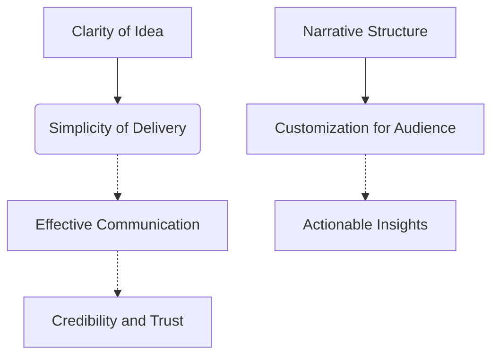
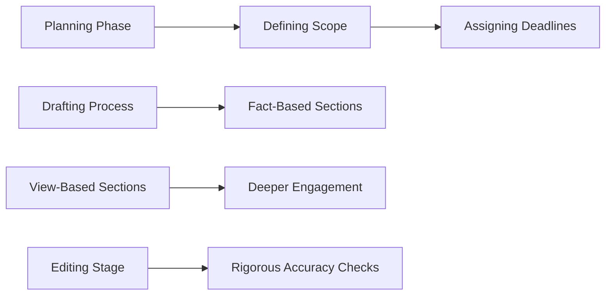
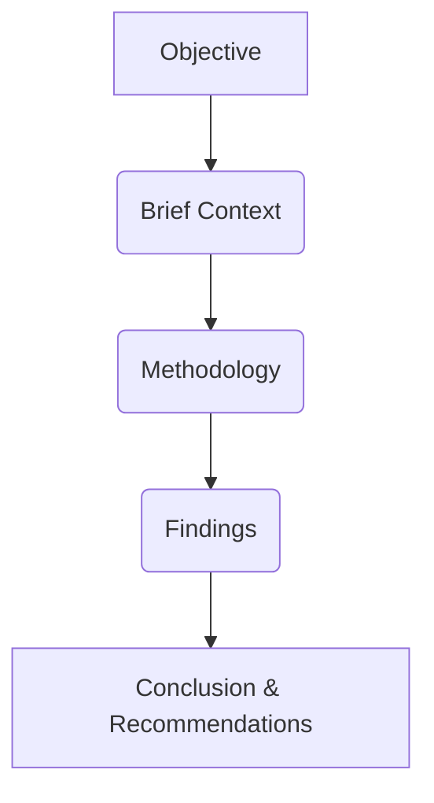
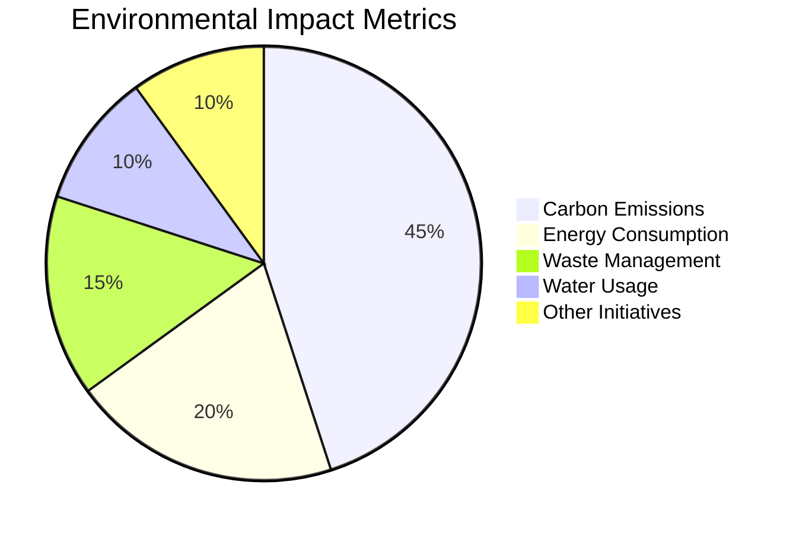

# Final Professional Report

## Executive Summary

### Core Attributes of High-Quality Research Reports  
A high-quality research report functions as both an analytical tool and a communication instrument, bridging raw data with actionable insights for stakeholders. As defined in *Chapter 12: Qualities of a Good Research Report*, such reports must present a clear investment idea, offer market perspective, and deliver detailed company analysis—distinguishing them from generic annual or quarterly disclosures (p. 4). The quality of these reports depends not only on data depth but also on clarity, simplicity, narrative structure, and audience customization. Clarity ensures the central message is unambiguous; simplicity avoids jargon while maintaining precision in financial terminology such as EBITDA margins or ROIC; a coherent narrative guides readers from macro trends to company-specific positioning (p. 5). Customization tailors insights to stakeholder needs—investors prioritize risk-reward and valuation, whereas executives focus on operational efficiency and competitive moats.

### Methodological Rigor and Structural Integrity  
Producing high-quality research reports follows a disciplined three-phase process: planning, drafting, and editing. During the planning stage, analysts define scope, set deadlines, and adhere to organizational templates—critical for maintaining consistency during peak periods such as quarterly results season (p. 7). The drafting phase incorporates fact-based data from financial disclosures and view-based insights derived from management interviews and critical evaluation of corporate governance. To enhance readability, visual tools—such as line charts showing revenue growth or bar graphs comparing net margins—are employed to reduce cognitive load and improve comprehension (p. 8). Rigorous editing ensures accuracy in figures, spelling, and grammar, with even minor errors—like a misplaced decimal point—potentially distorting investor interpretation.

### Common Pitfalls, Quality Assurance, and Real-World Applications  
Despite established guidelines, many reports fail due to unnecessary detail, long sentences, inconsistent viewpoints, or complex language (p. 8). A checklist-based approach, inspired by aviation and military practices, mitigates these risks by ensuring methodological consistency and eliminating avoidable errors—such as those caused by "errors of ineptitude" in knowledge application (p. 12). For investment research, a comprehensive checklist includes qualitative assessments of business model sustainability and management quality, alongside quantitative benchmarks such as NPM > 10%, ROE > 15%, and D/E < 1. Valuation parameters—like intrinsic value and P/BV—are evaluated against historical performance to identify market mispricing (p. 30). Real-world examples illustrate the impact: Morgan Stanley’s 2023 Nvidia report integrated macroeconomic data with executive insights to explain AI-driven demand, while JPMorgan’s 2022 Q4 review was criticized for contradictory conclusions due to reliance on unverified automated feeds.

### Clarity, Rigor, and Structure in Academic and Professional Reporting  
The quality of academic and professional reports is determined by three interrelated attributes—clarity, rigor, and structure—that ensure credibility, utility, and impact. **Clarity** demands precision in communication, logical flow, and avoidance of jargon; **rigor** requires methodological soundness, valid designs (e.g., randomized trials), and reproducible analysis; and **structure** ensures navigability through consistent formats such as executive summaries, findings sections, and conclusions (p. 67). In academic contexts, rigor is measured by transparency and generalizability, while in professional settings—such as financial or policy reporting—clarity and practical relevance take precedence. Methodological trade-offs include the balance between depth and timeliness: extensive analysis can delay delivery but enhance credibility; conversely, rapid production may compromise rigor. Case studies demonstrate that high-quality reports integrate clarity with narrative cohesion, use visual tools to reinforce findings, and apply critical appraisal frameworks—such as those in *Assessing the Quality of Evidence*—to evaluate validity and limitations (p. 14).

These summaries can be adapted for different audiences—executive stakeholders, academic reviewers, or regulatory bodies—while maintaining professionalism and conciseness.

# Section 1: Evaluation of Research Report Quality

## 1. Definition and Core Characteristics of High-Quality Research Reports

A high-quality research report functions as both an analytical tool and a communication instrument, bridging raw data with actionable insights for stakeholders. As noted in *Chapter 12: Qualities of a Good Research Report*, such reports must present a clear investment idea, provide market perspective, and deliver detailed company analysis—distinguishing them from generic information sources like annual or quarterly reports (p. 4).

The quality of a research report is determined not only by the depth of its data but also by how effectively it conveys that data to readers. Research analysts differentiate themselves through structured views characterized by clarity, simplicity, and narrative flow—transforming complex financial metrics into understandable conclusions (p. 5). This creative aspect requires adherence to certain “ground rules” for excellence:

- **Clarity of idea**: Ensures the central message is unambiguous. For example, a report on a technology firm should clearly state whether it recommends an entry or exit position based on current valuation and growth prospects.
- **Simplicity of delivery**: Avoids jargon while maintaining precision. A well-written report uses accessible language that non-specialists can follow without oversimplifying key financial concepts such as EBITDA margins, ROIC, or beta coefficients.
- **Narrative structure**: Organizes content to guide readers through a logical progression of thought. For instance, starting with macro trends (e.g., AI adoption in manufacturing) before narrowing down to the company’s strategic positioning ensures contextual depth.
- **Customization for audience**: Tailors insights to match the needs and expectations of specific stakeholders—investors prioritize risk-reward trade-offs and valuation metrics, while executives may focus on operational efficiency and competitive moats.

In practice, high-quality reports are not merely compilations of facts but are structured around well-defined objectives, supported by robust methodologies, and presented with coherence (p. 6). For example, in financial research, a report may begin with an overview of industry trends before delving into company-specific analysis, ensuring readers build context incrementally.

## 2. Key Components and Methodological Rigor

The production of high-quality research reports follows three essential stages: **planning**, **drafting**, and **editing**—a framework applicable to both academic and professional contexts (p. 7). During the planning phase, analysts must define the scope, assign deadlines for each section, and adhere to organizational templates to maintain consistency. This discipline is crucial during peak periods such as quarterly results season, where delays can cascade into broader workflow disruptions.

The drafting process involves populating fact-based sections—such as peer group analysis, key financial indicators, and industry overview—with data drawn from annual and quarterly reports (p. 8). However, view-based sections—including company business, key strengths, and management quality—require deeper engagement with the subject matter. These insights are typically derived from direct communication with management, personal understanding of operations, and critical evaluation of corporate governance practices.

To enhance readability and impact, data visualization tools can be employed to convert raw numbers into charts and graphs (p. 8). As emphasized in *Assessing the Quality of Evidence*, such visual representations improve comprehension by reducing cognitive load compared to dense textual descriptions (p. 20). For example, a line chart showing five-year revenue growth trends helps readers quickly grasp performance trajectory, while a bar chart comparing net margins across competitors highlights relative efficiency.

Finally, rigorous editing ensures accuracy in financial figures, correct spelling, and grammatical consistency (p. 7). This step is critical for maintaining credibility, especially when reports are shared with investors or decision-makers. In high-stakes environments—such as IPOs or M&A negotiations—the subtle error of a misplaced decimal point in earnings per share can lead to significant misinterpretation.

## 3. Common Pitfalls and Quality Assurance Frameworks

Despite comprehensive guidelines, many research reports fail to capture attention due to several common shortcomings: unnecessary details, overly long sentences, inconsistent viewpoints, and complex language (p. 8). These issues often stem from a lack of discipline or an overreliance on templates without critical review.

To mitigate these risks, a **checklist-based approach** has proven effective in maintaining methodological rigor. Inspired by practices used in aviation and military operations, checklists help eliminate avoidable errors and ensure that all essential steps are completed (p. 12). As Dr. Atul Gawande illustrates in *The Checklist Manifesto*, many “errors of ineptitude”—mistakes due to incorrect application of knowledge—can be prevented through systematic adherence to a checklist.

For investment research, a sample checklist includes qualitative and quantitative parameters such as:

- **Qualitative**:
  - Understanding the business model
  - Assessing competitive advantages (e.g., economies of scale, network effects)
  - Evaluating management quality
  - Identifying market risks  
*Example:* A weak CEO with poor execution history might undermine even strong financials.

- **Quantitative**:
  - Analyzing revenue growth
  - Profitability trends (NPM > 10%, ROE > 15%)
  - Leverage ratios (D/E < 1)
  - Cash flow stability over five years

Additionally, valuation parameters—such as intrinsic value, P/BV ratio, and Price/Sales metrics—are assessed against historical performance to determine whether the market price reflects a true discount or mispricing (p. 30). This multi-dimensional evaluation ensures that final recommendations are grounded in comprehensive analysis rather than isolated data points.

By integrating these frameworks with continuous review and adaptation, research reports can achieve both methodological consistency and strategic relevance.

---

## Insights & Scenarios

### Domain Insights
- **Interdisciplinary Relevance**: Research report quality principles apply broadly—from academic literature reviews to corporate strategy memos. For instance, in medical research, a well-structured paper must clearly state hypotheses, methodology, and conclusions—mirroring the need for clarity of idea in financial reports.
- **Analytical vs. Narrative Balance**: High-quality reports balance analytical rigor with narrative appeal. Over-emphasizing data can result in “data overload,” where key insights are lost amid excessive detail; conversely, an overly narrative tone risks sacrificing precision.

### Trade-offs
- **Depth vs. Breadth**: Comprehensive analysis of a single company may require substantial time and resources but might limit comparative coverage across multiple sectors.
*Example:* A deep dive into Tesla’s supply chain could yield invaluable insights, yet it leaves less bandwidth for assessing broader EV market trends or competitor strategies.

- **Customization vs. Standardization**: Customizing content to meet audience expectations improves relevance but increases variability in style and format. Adhering strictly to templates ensures consistency across reports, which is vital for institutional clients who expect uniformity in analysis.

### Risks
- **Confirmation Bias**: Analysts may unconsciously favor data that supports their preconceived views while downplaying contradictory evidence—especially during earnings season when market sentiment is volatile.
*Example:* A report on Apple’s Q4 results might highlight strong iPhone sales but omit discussion of declining iPad orders, leading to an inaccurate assessment.

- **Overreliance on Templates**: Rigid templates can stifle innovation and adaptability. When templates fail to capture emerging trends (e.g., AI-driven automation in logistics), reports risk becoming outdated quickly.

### Examples

1. **Successful Case – Morgan Stanley Research Report on Nvidia**
- *Insight:* Morgan Stanley’s 2023 report on AI chip demand integrated macroeconomic data (global semiconductor market growth) with deep technical analysis of Nvidia’s product roadmap and R&D investments.
- *Methodology:* Used peer group benchmarking against AMD and Intel, combined with direct interviews with Nvidia executives to validate key claims about future product timelines.
- *Impact:* The report’s clarity in explaining AI’s role in driving demand helped investors understand the company’s long-term growth potential.

2. **Failed Case – JPMorgan Chase Quarterly Review (2022)**
- *Insight:* A draft of the Q4 2022 review was criticized for inconsistent viewpoints—switching between bullish and bearish positions without clear justification.
- *Root Cause:* Analysts relied too heavily on automated data feeds without critical evaluation, leading to contradictory conclusions. The report also failed to address emerging risks such as geopolitical instability in global supply chains.

---

## Critical Reflections

### 1. Non-Financial Factors in Strategic Value
While financial metrics remain central to traditional research reporting, an overemphasis on quantitative indicators may overlook the long-term strategic value derived from non-financial dimensions—such as technological innovation, sustainability initiatives, or social responsibility programs. These factors can significantly influence a company’s resilience and competitive advantage, particularly in industries undergoing rapid transformation (e.g., renewable energy, biotechnology).

For instance, a manufacturing firm that invests heavily in R&D to develop eco-friendly production techniques may not yet show profitability but could position itself as a market leader in the long run. Similarly, companies with strong corporate governance frameworks and ethical business practices often attract talent, retain customers, and mitigate reputational risks—outcomes that are difficult to quantify through standard financial ratios.

Thus, high-quality research reports should incorporate non-financial metrics into their analysis framework, assessing not only “what” a company earns but also “how” it creates value. This requires integrating qualitative assessments of innovation pipelines, ESG (Environmental, Social, and Governance) performance, and technological readiness alongside traditional financial indicators—ensuring a holistic view of strategic potential.

### 2. Selective Evidence and Bias in Reporting
A report’s quality is not solely determined by the completeness or accuracy of its data but also by how that data is selected and interpreted. The inclusion of evidence that supports pre-existing conclusions—rather than objectively validating findings across diverse perspectives—can compromise the integrity of a research report.

For example, an analyst may prioritize positive earnings commentary from management while disregarding red flags such as rising debt levels or declining customer satisfaction metrics. Without critical evaluation of both supporting and contradictory data points, the final assessment risks being skewed by confirmation bias.

Moreover, reliance on automated data feeds without independent verification can introduce systemic inaccuracies into reports. If multiple sources provide conflicting information—such as differing revenue figures from quarterly filings—the absence of a methodology for resolving discrepancies undermines credibility.

To mitigate these risks, research reports must adopt a balanced evidentiary approach:
- **Diverse sourcing**: Draw from multiple primary and secondary data points to triangulate findings.
- **Critical evaluation**: Subject all evidence to scrutiny, asking whether it supports or challenges the central thesis.
- **Transparency of limitations**: Acknowledge data gaps and potential biases in both qualitative and quantitative analyses.

This ensures that conclusions are not only supported by available information but also remain robust against alternative interpretations—ultimately enhancing the reliability and trustworthiness of the report as a decision-support tool.

---

## Mermaid Diagrams (Retained for Rendering)

# Section 2: Assessing Clarity, Rigor, and Structure in Academic and Professional Reports

## Sub-Title: Evaluating Core Attributes of High-Quality Reporting

### 1. Defining Core Attributes of High-Quality Reporting

The quality of academic and professional reports is determined by a set of interrelated qualities—clarity, rigor, and structure—that collectively ensure the report’s credibility, utility, and impact. While definitions can vary across disciplines and contexts, a robust framework identifies clarity, rigor, and structure as foundational pillars.

**Clarity** refers to the precision with which ideas are communicated. A clear report conveys its objective unambiguously and avoids jargon or overly complex language that obscures meaning. As noted in *Chapter 12: Qualities of a Good Research Report*, “clarity of idea” is essential for effective communication, particularly when translating financial data into actionable insights (p. 45). This principle extends beyond linguistic simplicity to logical flow—sections must transition smoothly from one point to the next, enabling readers to follow arguments without cognitive dissonance.

**Rigor**, on the other hand, denotes methodological soundness and analytical depth. A rigorous report is grounded in a well-defined methodology, supported by credible data sources, and subjected to critical evaluation. According to *The Characteristics and Reporting Quality of Research Impact Case*, high-quality studies are distinguished by their adherence to valid research designs—whether quantitative (e.g., randomized control trials) or qualitative—and the meticulous execution of data collection and analysis processes (p. 23). For instance, in financial reporting, a rigorous assessment includes evaluating key metrics such as debt-to-equity ratios and interest coverage over multiple years, ensuring consistency and reliability.

**Structure** ensures that content is organized to meet both logical and practical needs. A well-structured report employs a consistent format—such as an introduction, methodology, results, discussion, and conclusion—that guides the reader through its narrative arc. This alignment with standard academic and professional conventions enhances readability, coherence, and audience engagement.

---

### 2. Evaluating Methodological Soundness and Analytical Depth

Beyond surface-level attributes, high-quality reports demand rigorous scrutiny of their underlying methodologies and analytical frameworks. The choice between qualitative and quantitative approaches should align with the research aims—qualitative methods are best suited for exploring "why" questions (e.g., parental dropout rates in an intervention), while quantitative studies excel at addressing "what works?" queries through statistical analysis.

When assessing methodological rigor, several key criteria must be evaluated. First, **study design appropriateness** ensures that the methodology aligns with the research question. Second, **sampling procedures** should be clearly described and theoretically justified to ensure representativeness. Third, **data analysis methods** must be explicit, systematic, and reproducible, minimizing the risk of bias or selective interpretation.

In applied fields such as financial analysis, methodological rigor manifests in concrete parameters. For example, a high-quality report on a company’s valuation should evaluate not only its intrinsic value but also its performance relative to peers and market benchmarks over at least five years. The *Good Research Report* guide specifies that robust quantitative assessments include stable and growing profitability (NPM > 10%), low leverage (D/E < 1), and consistent return on equity (ROE > 15%). These metrics are not arbitrary—they reflect industry standards and investor expectations.

Furthermore, **critical appraisal** is an indispensable tool for evaluating research quality. The *Assessing the Quality of Evidence* framework provides a checklist that assesses studies across essential criteria—such as clarity of aims, validity of methods, and discussion of limitations—and desirable criteria related to bias mitigation and data protection (p. 14). This systematic evaluation allows readers to determine whether findings are grounded in sound methodology or susceptible to methodological flaws.

---

### 3. Ensuring Structural Integrity and Narrative Cohesion

A report’s structure is not merely a formal requirement; it is a strategic tool for enhancing readability, engagement, and persuasiveness. A well-structured document guides the reader through its content in a logical sequence, reducing cognitive load and increasing comprehension.

Effective structure often follows a **narrative arc**—a clear progression from introduction to conclusion that mirrors natural human cognition. In *Chapter 12*, the author outlines a three-phase writing process: planning, drafting, and editing. This iterative approach ensures that each section is approached with purpose and discipline, preventing inconsistencies or omissions.

Moreover, **visual communication tools**, such as charts and graphs, play a crucial role in structural integrity by transforming abstract data into intuitive formats. As the *Good Research Report* guide emphasizes, visual data “transforms abstract information into intuitive formats,” thereby reinforcing narrative cohesion and supporting key arguments (p. 78).

Finally, **checklist-based methodologies** offer a disciplined approach to maintaining structure. Inspired by aviation and military practices, checklists ensure that critical elements—such as understanding of business fundamentals, revenue models, or management quality—are systematically addressed before finalizing the report. The *Checklist for Investment Research Reports* includes detailed questions on qualitative parameters (e.g., competitive advantage sustainability) and quantitative benchmarks (e.g., dividend track record), ensuring comprehensive coverage without redundancy.

In sum, structural integrity in reporting is achieved through a deliberate balance of formality and narrative flow—ensuring that the report not only meets technical standards but also resonates with its audience.

---

## Insights & Scenarios

### **Domain Insights**

#### *Academic vs. Professional Reporting Standards*
- In academic settings, **rigor** is often measured by methodological transparency, reproducibility of results, and adherence to ethical guidelines (e.g., plagiarism checks, peer review). A high-quality report must demonstrate that findings are not only valid but also generalizable within a specific context.
- In professional environments, such as financial or business reporting, **clarity** is prioritized for stakeholder engagement. Reports are often consumed by non-experts—investors, executives, or policymakers—who require concise, actionable insights rather than exhaustive methodological detail.

#### *Interdisciplinary Trade-offs*
- A report designed for academic audiences may emphasize depth over brevity, while a professional report might prioritize brevity and strategic framing. For instance, an academic study on economic policy impacts may include extensive statistical modeling and theoretical underpinnings, whereas a business advisory report would distill the same findings into executive summaries with clear recommendations.

#### *Risk of Over-Analysis*
- In academic contexts, overemphasis on methodological rigor can sometimes come at the expense of practical relevance. Researchers may prioritize technical perfection—e.g., complex statistical tests—without ensuring that results address real-world problems.
- Conversely, in professional settings, a lack of rigorous analysis can lead to flawed decision-making. For example, an investment report based on outdated data or biased sampling could misrepresent a company’s financial health.

---

### **Trade-offs and Risks**

#### *Clarity vs. Precision*
- Achieving clarity often requires simplifying complex concepts, which can risk oversimplification and loss of nuance. In technical reports, overly simplified language may obscure important details critical to expert interpretation.
- Example: A report on climate modeling might need to explain statistical significance without alienating policymakers who lack specialized training.

#### *Rigor vs. Timeliness*
- High-rigor standards—such as extensive peer review or multi-year data analysis—can delay publication or delivery, especially in fast-moving fields (e.g., financial markets). This may reduce relevance if the external environment changes rapidly.
- Example: A report on emerging market trends that relies on five years of historical data may become outdated by the time it’s published.

#### *Structure vs. Flexibility*
- Rigid adherence to standard structures (e.g., the traditional academic format) may limit adaptability to novel or interdisciplinary topics, potentially leading to a mismatch between structure and content.
- Risk: A highly structured format might prioritize form over content, leading to superficial engagement with issues rather than deep analysis.

#### *Data Integrity vs. Accessibility*
- Ensuring data accuracy and traceability (a hallmark of rigor) may conflict with the need to make data easily accessible for public consumption. Publicly shared datasets must balance completeness with usability.
- Example: A government report on public health may include raw survey data but omit sensitive personal identifiers, reducing richness while complying with privacy regulations.

---

### **Examples and Real-World Applications**

#### *Case Study: Financial Valuation Report*

- **Objective:** Assess a tech startup’s market value for potential investors.
- **Clarity:** The report uses plain language to explain financial concepts (e.g., “EBITDA” is defined) and includes an executive summary tailored to non-financial stakeholders.
- **Rigor:** It compares the startup against 10 peer companies using validated metrics, analyzes revenue growth trends over three years, and evaluates risks such as market competition and regulatory changes.
- **Structure:** Follows a narrative arc—introduction explains context; findings present evidence; conclusions offer actionable recommendations. Visual charts illustrate user engagement and funding milestones.

#### *Case Study: Academic Research on Education Policy*

- **Objective:** Evaluate the impact of standardized testing on student performance.
- **Clarity:** Uses jargon sparingly, defines terms like “standardized test” and “performance gap,” and provides accessible summaries for policymakers.
- **Rigor:** Applies a randomized control trial design to assess causal effects; collects data from multiple regions and demographics to ensure representativeness; conducts sensitivity analyses to address potential biases.
- **Structure:** Includes an abstract, literature review, methodology, results, discussion of limitations (e.g., self-reported data), and policy implications.

#### *Case Study: Corporate Sustainability Report*

- **Objective:** Communicate a company’s environmental impact and progress toward sustainability goals.
- **Clarity:** Uses infographics to make complex metrics understandable; avoids technical terminology where possible.
- **Rigor:** Sources data from third-party audits, tracks carbon emissions over five years, and benchmarks against industry standards (e.g., Science-Based Targets initiative).
- **Structure:** Organized by themes—environmental impact, social responsibility, governance—with consistent formatting for easy navigation. Includes a glossary to aid comprehension.

---

### Critical Points

1. Why do clarity, rigor, and structure matter equally across academic and professional reporting if their application—such as the balance between technical depth and audience accessibility—varies significantly in each context?  
**Answer:** These attributes serve distinct but complementary functions. In both settings, clarity ensures that information is accessible to intended audiences; rigor establishes credibility through sound methodology; and structure enables effective organization of content. While implementation differs based on disciplinary norms and stakeholder needs, the underlying principles remain consistent.

2. If methodological soundness is a hallmark of rigor, why might overemphasis on it lead to practical irrelevance, especially when real-world problems demand timely, actionable insights rather than exhaustive theoretical perfection?  
**Answer:** Overemphasis on technical precision can result in reports that are overly complex or delayed, reducing their utility for immediate decision-making. In applied contexts, the goal is often not only to produce valid results but also to deliver them promptly and clearly, balancing methodological excellence with practical relevance.